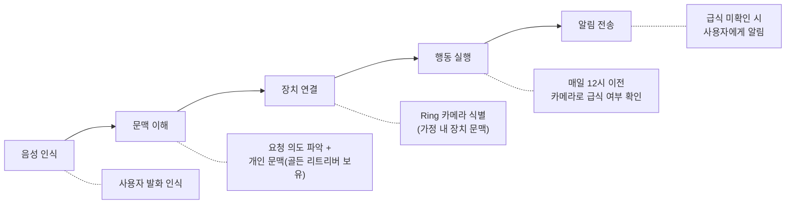
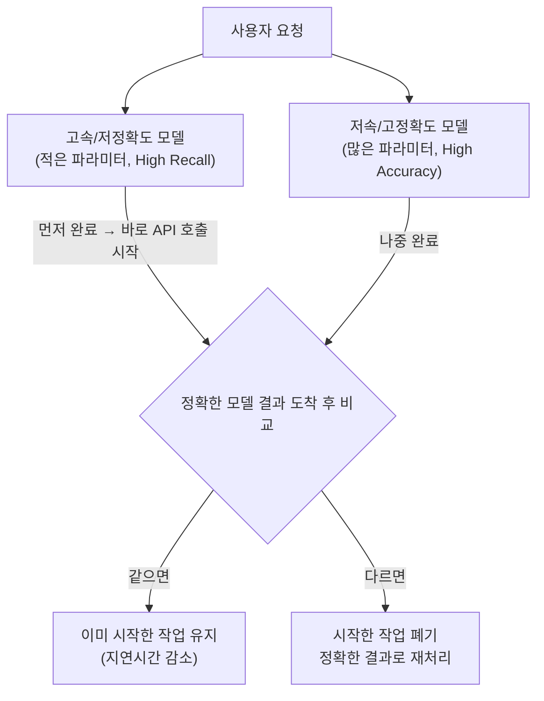
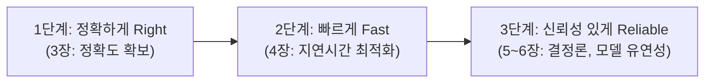

# AWS re:Invent 2025 - Alexa+ 대규모 대화형 AI 구축 및 관리 교훈 (AMZ305)

## Alexa란? — 한국 서비스와 비교

**Amazon Alexa**는 Amazon이 2014년에 출시한 **클라우드 기반 AI 음성 비서**로, 전용 스마트 스피커(Echo)를 비롯한 다양한 디바이스에 탑재되어 음성 명령으로 음악 재생, 날씨 확인, 스마트홈 제어, 쇼핑, 일정 관리 등을 수행한다. 한국에서는 직접 서비스되지 않지만, 유사한 서비스들이 있다.

| 비교 항목 | Amazon Alexa (미국) | SK NUGU (한국) | KT GiGA Genie (한국) | Samsung Bixby (글로벌) |
|-----------|---------------------|----------------|----------------------|------------------------|
| **출시** | 2014년 | 2016년 | 2017년 | 2017년 |
| **대표 디바이스** | Echo, Echo Dot, Echo Show | NUGU (캔), NUGU mini | GiGA Genie 셋톱박스 | Galaxy 스마트폰, TV |
| **호출어** | "Alexa" | "아리아" | "지니야" | "하이 빅스비" |
| **스마트홈** | 10억+ 연결 디바이스 | IoT 기기 제어 | 홈IoT 연동 | SmartThings 연동 |
| **생태계** | 수십만 개 스킬(Skills) | T맵, 멜론 등 SK 계열 연동 | KT 통신/IPTV 연동 | 삼성 가전 생태계 |
| **규모** | 6억+ 디바이스 | 국내 중심 | 국내 중심 | 글로벌 (제한적) |
| **Gen AI 전환** | Alexa+ (LLM 기반) | AI 고도화 중 | AI 고도화 중 | Bixby + Galaxy AI |

> Alexa는 한국의 NUGU, GiGA Genie와 같은 음성 비서이지만, 6억 개 이상의 디바이스와 수십만 개의 서드파티 스킬 생태계를 갖고 있다. 이 세션은 이 규모의 프로덕션 시스템을 생성형 AI로 전환하면서 겪은 교훈을 다룬다.

---

## 핵심 메시지

Amazon은 6억 개 이상의 디바이스에서 작동하는 10년 된 스크립트 기반 음성 비서 Alexa를 생성형 AI 기반 Alexa Plus로 전환했다. 이 과정에서 정확성(Accuracy), 지연 시간(Latency), 결정론(Determinism), 모델 유연성(Model Flexibility)이라는 네 가지 과제를 해결했으며, 단일 모델이 아닌 다중 모델 아키텍처와 반복적 실험을 통해 시스템을 재구축했다.

단계적 접근법: 먼저 정확하게(Right) → 그다음 빠르게(Fast) → 마지막으로 신뢰성 있게(Reliable)

---

## 1. Alexa의 진화와 생성형 AI 도입의 필요성

### Alexa의 초기 모습 (2014년)

| 항목 | 내용 |
|------|------|
| **출시** | 2014년, 미국에서만 서비스 |
| **초기 스킬** | Amazon이 개발한 약 13개 |
| **주요 기능** | 음악 재생, 단위 변환, 조명 제어 |
| **핵심 가치** | 핸즈프리 인터랙션, 장애인 접근성 |

#### 초기 기술적 난제
- 방 전체에서의 원거리 음성 인식 (Far-field Voice Capture)
- 고객 의도 이해 및 정보 검색
- **1~2초 이내** 응답 필수 (어색한 침묵 방지)

### 현재의 Alexa와 한계

- **6억 개 이상**의 고객 디바이스
- **10억 개 이상**의 연결된 제품 및 서비스
- 하지만 고객은 여전히 **"기계와 대화하는 느낌"** (일명 'Alexa Speak')
- 원하는 응답을 얻기 위해 특정 방식으로 문장을 구성해야 하는 한계

### Alexa Plus의 목표

| 목표 | 설명 |
|------|------|
| **더 대화적** | 자연스러운 대화 흐름, 특정 명령어 불필요 |
| **더 똑똑함** | "여기가 어둡네"의 실제 의도를 이해하여 조명 제어 |
| **개인화** | 가정 내 정보를 많이 알수록 더 스마트하게 작동 |
| **일 처리 완료** | 정보 제공을 넘어 **실제 예약, 구매까지 완료** |

발표자 언급: 다른 시스템들은 실제 예약이나 행동을 수행하려고 할 때 종종 실패한다.

---

## 2. Alexa Plus의 새로운 기능과 실제 작동 예시

세션에서 Alexa Plus의 시연 영상을 보여주었다. 위 목표들이 실제로 어떻게 구현되었는지를 보여주는 예시들이다:

- **복잡한 요청 처리**: 아이들 스케줄 관리, 생일 파티와 공항 픽업 충돌 해결, 차량 예약 제안
- **지능적 계획**: 봄 방학 여행지 추천 (해변+좋은 날씨 조건), Santa Barbara 특징 설명, 고래 관찰 투어 예약
- **실시간 상황 파악**: Ring 카메라로 강아지(Mozart) 외출 여부 확인

### 실제 복잡한 사용 사례: 강아지 급식 모니터링

> *"매일 정오까지 Daisy(크림 골든 리트리버)에게 밥이 주어지지 않으면 알려줘."*

이 간단한 요청 뒤의 복잡한 LLM 처리 과정:



이러한 멀티스텝 추론과 실행은 현재 LLM에게 어려운 작업이다. 발표팀은 이를 구현하면서 크게 네 가지 과제에 부딪혔다: 정확도, 지연 시간, 결정론, 모델 유연성. 아래부터 각 과제와 해결 방법을 순서대로 다룬다.

---

## 3. 도전 과제 1: 정확도 (Accuracy)

### 왜 정확도가 문제인가

챗봇은 답변이 약간 틀려도 사용자가 다시 질문하면 된다. 하지만 Alexa는 조명 켜기, 음악 재생, 티켓 예약 등 실제 행동을 수행해야 하므로, 잘못된 행동을 취하면 바로 문제가 된다. 또한 위 강아지 급식 예시처럼 여러 단계를 거치는 시스템에서는 각 단계의 오류가 누적되므로, 모든 단계에서 정확도를 높여야 한다.

### LLM이 실제로 하는 일: 라우팅 및 계획

Alexa Plus에서 LLM은 사용자 요청을 받아 실제 행동으로 변환하는 역할을 한다. 이 과정은 세 단계로 나뉜다:


| 단계 | 설명 | 중요도 |
|------|------|--------|
| **라우팅** | 알림/리마인더/캘린더 등 여러 Expert 중 적절한 것을 선택 | 발표자 강조: *"여기서 실패하면 다운스트림에서 복구하기 매우 어렵다"* |
| **API 선택** | 선택된 Expert가 제공하는 여러 API 중 어떤 것을 호출할지 결정 | 올바른 기능 수행에 직결 |
| **파라미터 추출** | 해당 API에 필요한 값(알림 시점, 조건, 빈도, 대상, 메시지 등)을 발화에서 추출 | 각 선택이 추론 사이클을 발생시킴 |

이 세 단계 각각에서 LLM의 정확도를 높이는 것이 과제였다. 발표팀이 시도한 방법과 실패 경험은 다음과 같다.

### 문제: 프롬프트 엔지니어링의 시행착오

#### 예시(Exemplar) 제공의 함정

| 단계 | 접근 방식 | 결과 |
|------|-----------|------|
| 초기 | API 호출 예시를 LLM에 제공 | 효과적 |
| 버그 발생 시 | 예시를 계속 추가 | 정확도가 오히려 감소 |
| 원인 분석 | 프롬프트 과부하(Prompt Overload) | 과적합 + 제한된 주의력으로 인한 망각 |
| 해결 | 충돌/불필요한 예시 대량 삭제 | 정확도 회복 |

#### 풍선 짜기(Squeezing a Balloon) 효과

한 영역의 문제를 해결하기 위해 문맥을 추가하면, 다른 영역에서 해당 문맥이 불필요하여 오히려 정확도를 떨어뜨리는 현상

- **스마트홈** "조명 켜줘" → 가정 내 조명 문맥 필요
- **음악** "음악 틀어줘" → 조명 문맥은 무관, 오히려 방해

### 대안: API 리팩토링

예시를 아무리 추가해도 프롬프트 과부하와 풍선 짜기 효과 때문에 한계가 있었다. 그래서 접근 방식을 바꿔, 프롬프트에 예시를 넣어서 LLM을 가르치는 대신 API의 이름, 파라미터명, 구조 자체를 직관적으로 리팩토링하여 LLM이 별도 예시 없이도 API의 용도를 추론할 수 있게 했다.

- 예: 모호한 API 이름이나 파라미터를 명확하게 변경하면, 예시 없이도 LLM이 올바른 API를 선택함
- 단, 지나친 명확성도 역효과 — `create_reminder` API에 "이 API를 사용하여 알림을 생성하라"는 중복 지침을 프롬프트에 추가하면 오히려 과적합 유발

---

## 4. 도전 과제 2: 지연 시간 (Latency)

정확도를 확보한 다음 문제는 속도였다. 챗봇과 Alexa는 지연 시간에 대한 허용 범위가 근본적으로 다르다.

| 특성 | 챗봇 | Alexa |
|------|------|-------|
| **응답 대기** | 타이핑하며 대기 가능 | 조명이 거의 즉시 켜져야 함 |
| **허용 지연** | "생각 중..." 표시 가능 | 어색한 침묵 발생 시 고객 이탈 |

LLM 작업 중 가장 시간이 많이 소요되는 부분은 사용자 요청을 처리하는 추론 사이클이다. 이를 줄이기 위해 전통적 기법부터 적용하고, 이후 LLM 특화 최적화를 추가했다.

### 전통적 지연 시간 감소 기법

LLM 도입 전부터 쓰던 일반적인 최적화 기법들을 먼저 적용했다.

**병렬화 (Parallelization)**
- 서로 의존성이 없는 API들을 순서대로 호출하지 않고 동시에 호출
- 예: 알림 Expert와 캘린더 Expert에 동시에 쿼리를 보내서 대기 시간을 줄임

**스트리밍 (Streaming)**
- 이전 작업이 완전히 끝날 때까지 기다리지 않고(Finish-to-Start), 이전 작업이 시작되자마자 다음 작업도 시작(Start-to-Start)
- 예: 사용자가 "let me know when…"이라고 말하는 시점에, 발화가 끝나기 전에 이미 알림 Expert를 선택하는 작업을 시작

**사전 인출 (Pre-fetching)**
- 사용자가 웨이크 워드("Alexa")만 말해도, 실제 요청이 오기 전에 필요할 가능성이 높은 정보를 미리 수집
- 예: 대화 중인 디바이스 정보, 타임존, 위치, 개인화 설정 등을 발화가 끝나기 전에 준비 완료

이 기법들은 도움이 되었지만, LLM 추론 사이클 자체가 느린 문제는 해결하지 못했다. 그래서 LLM에 특화된 최적화가 추가로 필요했다.

### LLM 특화 최적화 1: 토큰 처리

LLM의 지연 시간은 결국 토큰을 처리하는 시간이다. 발표팀은 여기서 입력 토큰과 출력 토큰의 비용 차이가 크다는 점에 주목했다. 출력 토큰 생성은 입력 토큰 처리보다 수십 배(발표 원문: *multiple orders of magnitude*) 더 많은 시간이 소요된다. 따라서 출력 토큰을 줄이는 것이 지연시간 감소에 가장 직접적인 효과가 있었다.

구체적으로 적용한 기법들:

#### 출력 토큰 줄이기: Chain of Thought (CoT) 제거

CoT는 LLM에게 "소리 내어 생각하라"고 지시하여 추론 과정을 출력하게 하는 기법이다. 정확도 향상과 디버깅에 유용하지만, 사고 과정 자체가 출력 토큰이므로 지연시간이 크게 늘어난다.

- 발표자 비유: *"프로덕션에서 모든 요청에 trace 레벨 로깅을 켜고 디스크에 플러시하는 것과 같다"*
- CoT를 끄면 정확도가 떨어질 수 있지만, 이는 뒤에서 다루는 파인튜닝(Alexa 트래픽 데이터로 모델을 특화시켜 CoT 없이도 정확도를 유지)과 API 리팩토링(LLM이 더 적은 추론으로 올바른 결과를 내도록 API 구조 개선)으로 보완했다
- 결론: 개발/디버깅에서만 사용하고, 프로덕션에서는 비활성화

#### 입력 토큰 줄이기 (1): 프롬프트 캐싱 (Prompt Caching)

프롬프트에는 매 요청마다 반복되는 부분(Alexa의 신원, 사용 가능한 도구 목록 등)이 많다. 이 부분을 캐싱하면 매번 다시 처리하지 않아도 된다.

- "Alexa stop"처럼 자주 반복되는 발화에 매번 추론 사이클을 돌릴 필요가 없음
- 개발 시작 당시 모델에 캐싱 기능이 없어서, AWS 및 모델 제공업체와 협력하여 직접 개발
- 캐싱 적중률을 높이려면 토큰 순서가 중요 — 안정적인 정보(신원, 도구 목록)를 프롬프트 앞부분에, 자주 변하는 정보(고객별 식별자 등)를 뒷부분에 배치

#### 입력 토큰 줄이기 (2): 프롬프트 축소화 (Minification)

프롬프트 자체의 토큰 수를 줄이는 방법이다.

- **식별자 축소**: 고객마다 다른 긴 고유 식별자(디바이스 ID 등)를 짧은 값으로 대체하여 LLM에 입력하고, 출력 시 원래 값으로 복원. 토큰 수 감소 + 고객마다 달라서 발생하는 캐시 미스도 방지
- **명령어 튜닝**: LLM을 활용하여 프롬프트 지시문을 더 적은 단어로 같은 의미를 전달하도록 재작성

주의: 모델마다 토크나이저가 다르므로, 특정 모델의 토큰화 방식에 너무 의존하면 모델 교체 시 문제가 될 수 있음

### LLM 특화 최적화 2: 모델 수준 기법

토큰 처리 최적화 외에, 모델 자체를 활용하여 지연시간을 줄이는 기법도 적용했다.

#### 추측 실행 (Speculative Execution)

파라미터가 적은 모델은 빠르지만 정확도가 낮고, 파라미터가 많은 모델은 정확하지만 느리다. 이 차이를 활용하여 두 모델을 동시에 실행하는 방법이다.

핵심은 **빠른 모델의 결과가 나오는 즉시, 정확한 모델을 기다리지 않고 바로 후속 작업(API 호출 등)을 시작**하는 것이다. 이후 정확한 모델의 결과가 도착했을 때:
- **결과가 같으면**: 이미 시작한 후속 작업이 유효하므로, 빠른 모델의 응답 시점부터 작업이 진행된 셈 → 지연시간 감소
- **결과가 다르면**: 이미 시작한 작업을 폐기하고, 정확한 모델의 결과로 다시 처리 → 지연시간은 정확한 모델만 쓴 것과 동일

빠른 모델이 충분히 정확한 경우가 많기 때문에, 전체적으로 평균 지연시간이 줄어든다.



빠른 모델의 결과로 먼저 API를 호출하므로, 그 API가 잘못 호출되어도 문제가 없어야 한다:
- 선행 API 호출이 멱등성(Idempotent)이거나, 부작용이 없거나, 되돌릴 수 있는(Undo) API여야 함
- 예: 잘못된 조명을 켜거나, 조명 요청에 음악을 재생하는 상황이 발생하면 안 됨

#### 추론 사이클 최소화

위의 기법들(토큰 최적화, 추측 실행)은 각 추론 사이클을 더 빠르게 만드는 것이었다. 하지만 발표자가 가장 효과가 컸다고 언급한 방법은, LLM에게 "생각해달라"고 요청하는 횟수 자체를 줄이는 것이었다.

**API 리팩토링 (지연시간 관점)**
- 3장에서의 API 리팩토링은 API 이름과 구조를 명확하게 바꿔 LLM이 올바른 API를 선택하도록 한 것이었다 (정확도 관점)
- 여기서는 다른 관점이다. 예를 들어 알림을 설정하려면 원래 3개의 API를 순서대로 호출해야 했다면, LLM은 3번 생각해야 한다. 이 3개를 1개의 API로 합치면 LLM은 1번만 생각하면 된다

```
Before: API_A → LLM 생각 → API_B → LLM 생각 → API_C (3번 추론)
After:  API_ABC (1번 추론)
```

**파인튜닝 (Fine-tuning)**
- 파인튜닝이란: LLM 벤더가 제공하는 범용 모델(Foundation Model)을 가져다가, 특정 도메인의 데이터로 추가 훈련시켜 해당 도메인에 특화된 모델로 만드는 것
- 왜 추론 사이클이 줄어드는가: 범용 모델은 "조명 켜줘"라는 요청에 여러 단계를 거쳐 생각해야 하지만, Alexa 고객 트래픽 데이터로 파인튜닝된 모델은 이런 패턴을 이미 학습했기 때문에, 한 번의 추론으로 바로 올바른 Expert와 API를 선택할 수 있다
- 앞서 CoT를 프로덕션에서 끄면 정확도가 떨어질 수 있다고 했는데, 파인튜닝으로 모델이 Alexa 패턴에 익숙해지면 CoT 없이도 정확도를 유지할 수 있다

---

## 5. 도전 과제 3: 결정론 (Determinism)과 창의성의 균형

정확도와 속도를 잡은 다음에는, 일관성 문제가 드러났다. 기존 Alexa는 전통적인 규칙 기반 시스템이라 같은 입력에 항상 같은 결과를 냈지만, LLM은 통계 기반의 비결정론적 모델이라 매번 다른 결과를 낼 수 있다.

### 문제: 상반되는 두 가지 요구사항

| 상황 | 기대 동작 | 문제 |
|------|-----------|------|
| **도구적 사용** ("조명 켜줘") | 항상 100% 일관되게 실행 | 비결정론적 LLM은 "대부분의 경우"만 작동 |
| **대화적 사용** ("심심해") | 때로는 음악, 때로는 이전 대화 이어가기 | 과도한 최적화 시 로봇처럼 변함 |

정확도와 속도를 위해 시스템을 일관되게 튜닝할수록, LLM은 점점 더 로봇처럼 변하여 개성과 창의성을 잃었다. 반대로 창의성을 살리면 조명 켜기 같은 기본 동작의 일관성이 떨어졌다.

### 해결: 사용 사례별 분리

- 도구적 사용 사례("조명 켜줘")는 결정론적으로 유지하여 항상 같은 결과 보장
- 대화적 사용 사례("심심해")는 의도적으로 결정론을 낮추어 창의성과 개성을 발휘하도록 허용
- 예: "심심해"라고 하면 때로는 음악을 제안하고, 때로는 이전에 이야기했던 여행지 대화를 이어가기도 함

### 컨텍스트 엔지니어링

결정론과 창의성의 균형을 맞추려면, LLM에 어떤 문맥을 넣느냐가 중요하다. 발표팀은 이를 컨텍스트 엔지니어링이라고 불렀다.

**RAG (Retrieval Augmented Generation)**
- LLM은 훈련 시점의 데이터만 알고 있으므로, 최신 이벤트나 사용자 개인 정보는 외부에서 가져와 프롬프트에 넣어야 한다
- 예: 사용자가 Red Sox 팬이라는 정보를 RAG로 가져오면, 이를 바탕으로 Yankees를 놀리는 개인화된 응답이 가능해진다

**선별적 문맥 제공**
- 3장의 풍선 짜기 효과와 같은 문제가 여기서도 발생한다. 스마트홈 요청에 음악 문맥을 넣으면 방해가 되고, 음악 요청에 조명 문맥을 넣으면 환각이 발생할 수 있다
- 요청 유형에 따라 필요한 문맥만 선별적으로 제공해야 한다

**환각 방지**
- LLM이 집에 없는 스피커를 만들어내고 거기서 음악을 재생하려는 상황을 막기 위해, 실제 가정 내 디바이스 목록을 정확하게 제공

**Recency Bias 활용**
-- LLM은 인간처럼 프롬프트 끝부분의 내용에 더 큰 가중치를 부여한다                                                                                                                                                            
-- 이 특성을 활용하여 중요한 지시사항을 프롬프트 끝에 배치하되, 4장에서 다룬 캐싱 효율(안정적 정보를 앞에 배치)과의 균형도 고려해야 한다

### 안전성 (Safety)

결정론과 창의성 사이에서 균형을 잡더라도, 안전성은 양보할 수 없는 부분이다. 발표팀은 이를 *"Safety is non-negotiable"*이라고 강조했다.

Alexa+는 벨트와 멜빵(Belts and Suspenders) 접근법을 사용한다. 하나의 안전장치만 믿지 않고 여러 겹으로 방어한다:
- 1차 방어: 프롬프트에 안전 지침을 포함하여 모델이 스스로 위험한 응답을 생성하지 않도록 유도
- 2차 방어: 프롬프트만으로는 모델이 실패할 수 있으므로, 모델 외부에 별도의 가드레일을 배치. 가드레일은 입력 단계에서 위험한 요청을 차단하고, 출력 단계에서 부적절한 응답을 필터링하는 별도의 검증 레이어다

---

## 6. 도전 과제 4: 모델 유연성 (Model Flexibility)

앞의 세 가지 과제(정확도, 지연시간, 결정론)를 해결하면서, 하나의 모델로는 모든 상황을 최적으로 처리할 수 없다는 것을 깨달았다. 정확도를 높이려면 큰 모델이 필요하지만 느려지고, 속도를 높이려면 작은 모델이 필요하지만 정확도가 떨어진다. 사용 사례마다 요구사항이 다르기 때문에, 처음부터 멀티 모델 아키텍처를 설계한 것이 중요했다.

### 왜 멀티 모델인가

| 고려 요소 | 트레이드오프 |
|-----------|-------------|
| **정확도** | 높은 정확도가 필요한 사용 사례에는 큰 모델, 단순한 사용 사례에는 작은 모델 |
| **지연시간** | 즉시 응답이 필요한 경우(조명 제어) 작은 모델, 약간의 지연이 허용되는 경우(여행 계획) 큰 모델 |
| **비용** | 모든 요청에 큰 모델을 사용하면 GPU 비용이 과다 |
| **창의성** | 도구적 사용에는 결정론적 모델, 대화적 사용에는 창의적 모델 |

초기 모델들의 성능 한계 때문에 어쩔 수 없이 멀티 모델 아키텍처를 구축했는데, 이것이 나중에 새로운 모델이 나왔을 때 쉽게 교체할 수 있는 유연성을 제공했다.

### 모든 문제에 LLM이 필요하지는 않다

멀티 모델은 여러 LLM을 쓴다는 의미만이 아니다. 애초에 LLM이 필요 없는 작업도 많았다.

LLM만 사용하는 것이 아니라, 작업 특성에 따라 전통적 ML 모델과 조합하여 사용했다.

| 사용 사례 | 적합한 모델 | 이유 |
|-----------|-------------|------|
| **"Alexa stop"** | 비LLM 전통 모델 | 단순 명령에 LLM 추론 사이클을 돌리는 것은 비용과 시간 낭비 |
| **PDF 기반 질의응답** | 특수 목적 ML 모델 | PDF 전체를 LLM 프롬프트에 넣으면 토큰이 많아져 느려짐. 관련 정보 추출은 전통 ML이 더 효율적 |
| **복잡한 대화** | LLM | 자연어 이해와 복잡한 추론이 필요한 경우에만 LLM 사용 |
| **조건부 알림** | LLM + 전문 에이전트 | 라우팅과 파라미터 추출은 LLM이, 실제 실행은 전문 시스템이 담당 |

### 새로운 과제: 모델 선택

여러 모델이 존재하면, 어떤 요청에 어떤 모델을 사용할지 선택하는 것이 새로운 과제가 된다. 4장의 추측 실행처럼 모든 모델을 동시에 호출하고 가장 좋은 답변을 선택할 수도 있지만, 이는 GPU 비용과 용량이 그만큼 늘어난다. 발표팀은 이를 *"양파 껍질 벗기기"*로 비유했다 — 한 문제를 해결하면 새로운 문제가 드러나는 과정의 반복이다.

### AWS 서비스 활용

이런 멀티 모델 아키텍처를 운영하기 위해 두 가지 AWS 서비스를 활용했다.

| 서비스 | 역할 |
|--------|------|
| **Amazon Bedrock** | 여러 LLM을 런타임에 교체할 수 있게 해주는 서비스. 코드 변경 없이 백엔드 모델을 바꿀 수 있어 멀티 모델 아키텍처 운영에 활용 |
| **Amazon SageMaker** | "Alexa stop" 처리, PDF 파싱 등 LLM이 필요 없는 작업을 위한 맞춤형 ML 모델을 구축하고 훈련하는 데 활용 |

---

## 7. 핵심 교훈 및 결론

발표팀이 네 가지 과제를 해결하면서 얻은 교훈을 세 가지로 정리했다.

### 교훈 1: 모델 유연성 (Model Flexibility)

- 초기에 멀티 모델 아키텍처를 설계한 것이, 이후 새로운 모델로 교체하거나 사용 사례별로 최적 모델을 선택하는 데 도움이 됨
- 하나의 모델이 모든 것에 적합하지 않았고, 사용 사례에 맞게 모델 크기를 조정하는 것이 나았음
- 정확도, 속도, 비용은 사용 사례마다 균형점이 다르므로, 한 모델에 모든 것을 맞추려 하지 말아야 함

### 교훈 2: 반복적 실험의 필수성 (Iterative Experimentation)

- 4장에서 다룬 것처럼, 병렬화/스트리밍 같은 전통적 기법만으로는 부족했고, 프롬프트 캐싱/API 리팩토링/추측 실행 등 새로운 기술을 혼합해야 했음
- 이론적으로 작동하는 것이 프로덕션 환경, 특히 대규모에서 항상 작동하는 것은 아님
- 한 문제를 해결하면 새로운 문제가 드러나는 과정(발표자 비유: *"양파 껍질 벗기기"*)이 반복되므로, 실험을 프로세스에 내재화해야 함

### 교훈 3: 단계적 진행 (Step Progression)

이 세션의 구성 자체가 이 순서를 따른다. 3장(정확도) → 4장(속도) → 5~6장(신뢰성/유연성) 순으로, 각 단계를 확보한 뒤 다음 단계로 나아갔다.



---

## 주요 시사점

각 장에서 다룬 내용 중, 다른 프로젝트에도 적용할 수 있는 포인트를 정리한다.

**정확도 관련 (3장)**
1. 라우팅(Expert 선택)이 첫 단계이자 가장 중요한 단계 — 여기서 오류가 나면 하류에서 복구하기 어려움
2. 예시(exemplar)를 과도하게 제공하면 오히려 프롬프트 과부하로 정확도가 떨어짐
3. 프롬프트에 예시를 넣는 대신, API 자체를 직관적으로 설계하는 것이 더 효과적

**지연시간 관련 (4장)**
4. 출력 토큰이 입력 토큰보다 수십 배 비싸므로, 출력 토큰(CoT 등)을 먼저 줄여야 함
5. 추론 사이클 횟수 자체를 줄이는 것(API 통합, 파인튜닝)이 개별 사이클 최적화보다 효과가 컸음
6. 전통적 기법(병렬화, 스트리밍)과 LLM 특화 기법(캐싱, 추측 실행)을 혼합해야 함

**결정론/안전성 관련 (5장)**
7. LLM은 프롬프트 끝부분에 더 큰 가중치를 부여함(Recency Bias) — 캐싱 효율과의 균형 필요
8. 과도한 최적화로 로봇같아진 시스템에 다시 창의성을 넣는 역방향 튜닝이 필요했음
9. 안전성은 모델 프롬프트만으로 부족하고, 입출력 양쪽에 별도 가드레일이 필요

**모델 유연성 관련 (6장)**
10. 모든 문제에 LLM이 필요하지 않음 — 단순 명령이나 PDF 파싱은 전통 ML이 더 효율적
11. 멀티 모델 아키텍처를 초기에 설계해두면, 이후 모델 교체와 사용 사례별 최적화가 수월함

---

## 사용된 AWS 서비스

| 서비스 | 역할 |
|--------|------|
| **Amazon Alexa / Alexa+** | 6억+ 디바이스 탑재 음성 비서 |
| **Amazon Bedrock** | 런타임 모델 교체를 지원하는 멀티모델 인프라 |
| **Amazon SageMaker** | 맞춤형 비LLM ML 모델 구축 및 훈련 |
| **Ring** | 스마트홈 보안 카메라, Alexa+와 통합 |
