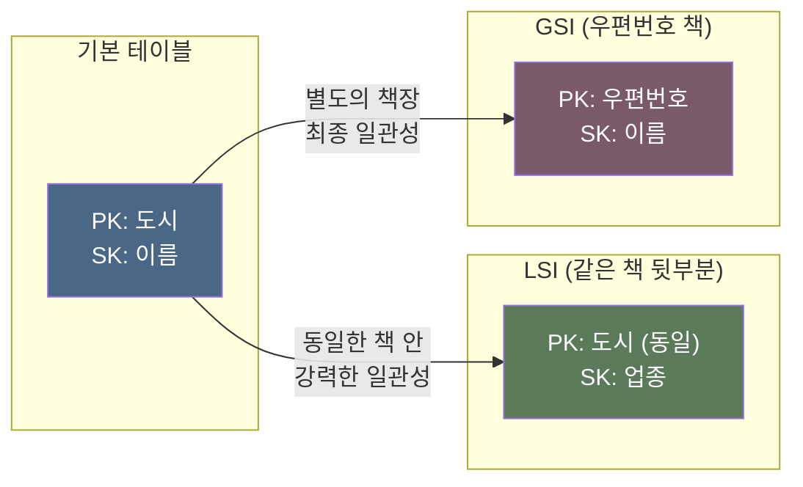
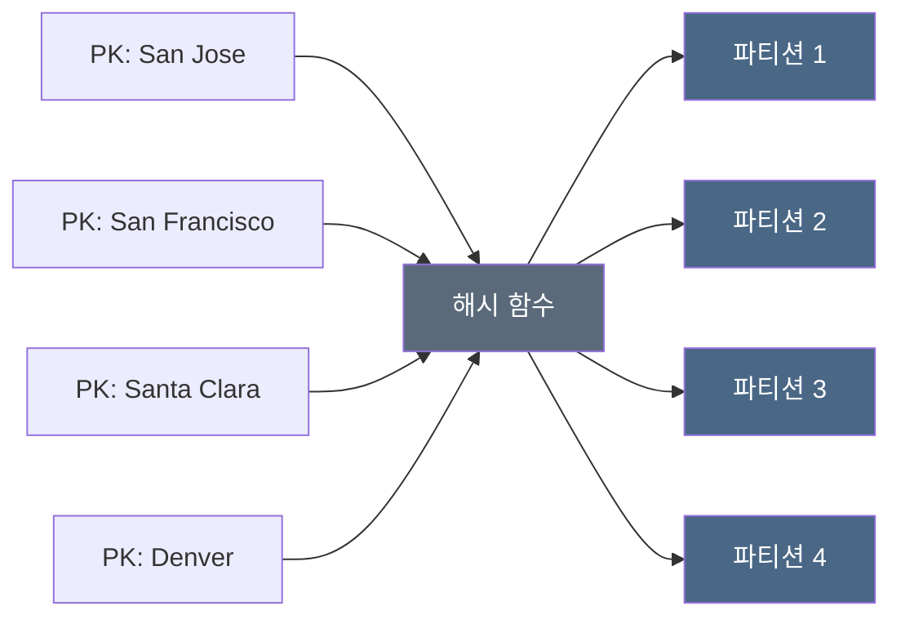
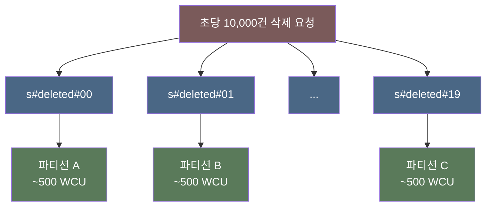
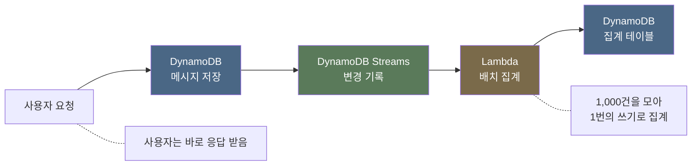

# AWS re:Invent 2025 - Amazon DynamoDB 데이터 모델링 핵심 개념 (DAT311)

## 세션 개요

**발표자**: Jason Hunter (Principal Solution Architect, DynamoDB 전문)

**주제**: DynamoDB의 데이터 모델링 핵심 개념부터 엔터프라이즈급 최적화 전략까지, 전화번호부와 도서관 비유를 통해 파티션 키/정렬 키/인덱스의 작동 원리를 설명하고, 챗봇 히스토리 시스템을 함께 설계하며 실전 모델링 기법을 다룬다.

**핵심 접근**: 하나의 파티션 키에 대해 제대로 설계하면, 수백만 파티션 키로 그대로 확장된다.

---

## 1. 전화번호부로 이해하는 DynamoDB

DynamoDB를 도서관의 전화번호부에 비유하여 기본 테이블의 구조를 설명한다.

### 기본 테이블 구조

| 전화번호부 | DynamoDB | 역할 |
|-----------|----------|------|
| 표지에 적힌 도시 이름 | **파티션 키(PK)** | 어떤 데이터 묶음으로 갈지 결정 |
| 이름순 정렬 목록 | **정렬 키(SK)** | 해당 묶음 안에서 원하는 항목을 빠르게 찾기 |
| 전화번호, 주소 | **페이로드** | 실제 데이터 |

쿼리는 항상 PK를 지정한 뒤, SK로 범위를 좁히는 방식이다. SK에는 `starts with`, `between`, `range` 쿼리가 가능하지만, `ends with`는 지원하지 않는다. PK/SK가 아닌 속성으로도 필터 조건을 걸 수 있지만, 이미 읽어온 결과에서 걸러내는 것이라 읽기 비용은 그대로 발생한다.

### 인덱스: LSI와 GSI

기본 테이블만으로는 조회할 수 있는 방법이 제한적이다. 예를 들어 도시(PK) + 이름(SK)으로만 찾을 수 있는데, 우편번호로도 찾고 싶다면? 이럴 때 인덱스를 추가한다.

| 특성 | LSI (로컬 보조 인덱스) | GSI (글로벌 보조 인덱스) |
|------|----------------------|------------------------|
| **파티션 키** | 기본 테이블과 동일 | 다른 키 선택 가능 |
| **비유** | 같은 전화번호부 안에서 업종별로 다시 정렬한 페이지 | 우편번호별로 분류한 별도의 책 |
| **일관성** | 강력한 일관성 지원 | 최종 일관성만 지원 (보통 1~10ms) |
| **업데이트** | 기본 테이블과 동시에 | 비동기 전파 |
| **생성/삭제** | 테이블 생성 시에만 추가, 삭제 불가 | 언제든 추가/삭제 가능 |
| **처리량** | 기본 테이블의 RCU/WCU를 공유 | 별도의 RCU/WCU를 가짐 (RCU = 읽기 용량 단위, WCU = 쓰기 용량 단위) |
| **크기 제한** | 같은 PK를 가진 데이터 합계 10GB | 제한 없음 |
| **테이블당 최대 개수** | 5개 | 20개 |

#### 실무에서 LSI를 잘 안 쓰는 이유

LSI의 유일한 장점은 강력한 일관성 읽기인데, 이걸 위해 감수해야 할 제약이 많다:

- **테이블 설계 시점에 결정해야 한다**: 나중에 "이 인덱스 필요 없었네" 해도 삭제할 수 없다. 테이블을 새로 만들어 데이터를 마이그레이션해야 한다.
- **10GB 제한이 발목을 잡는다**: 같은 PK 아래 데이터가 10GB를 넘으면 쓰기가 거부된다. 서비스가 커지면서 데이터가 늘어날 때 갑자기 터지는 문제다.
- **기본 테이블 처리량을 나눠 쓴다**: LSI 읽기가 기본 테이블의 RCU를 소모하므로, 기본 테이블 쿼리 성능에 영향을 줄 수 있다.
- **파티션 분할도 막힌다**: LSI가 있으면 같은 PK 내부를 파티션 분할할 수 없어서, 하나의 PK에 트래픽이 몰릴 때 대응이 어렵다.

반면 GSI는 최종 일관성(보통 1~10ms)을 감수하면 이런 제약이 전부 없다. 그래서 **강력한 일관성이 반드시 필요한 경우가 아니라면 GSI를 우선 검토**하는 것이 일반적이다.

---

## 2. 파티션 작동 원리

### 해싱을 통한 균등 분산

"파티션 키 하나 = 파티션 하나"라고 오해하기 쉽지만, 실제로는 다르다. DynamoDB는 파티션 키 값을 **해시 함수**에 넣어서 나온 결과값으로 어느 파티션에 저장할지 결정한다. 쉽게 말해, 키 값을 섞어서 여러 파티션에 골고루 뿌리는 것이다. 그래서 내부적으로 파티션 키를 "해시 키"라고 부르기도 한다.

왜 알파벳순이 아니라 해싱을 쓸까? San Jose, San Francisco, Santa Clara처럼 이름이 비슷한 도시들을 알파벳순으로 넣으면 전부 같은 파티션에 몰린다. 해싱을 쓰면 이름이 비슷해도 서로 다른 파티션에 분산된다.

### 데이터 복제와 일관성

DynamoDB는 데이터를 같은 리전 안에서 물리적으로 떨어져 있는 **3개의 데이터센터(가용 영역, AZ)**에 각각 복사해둔다. 한 곳이 장애가 나도 나머지 2곳에 데이터가 있으니 서비스가 유지된다. 사용자가 직접 AZ나 서브넷을 설정할 필요 없이, DynamoDB 엔드포인트만 호출하면 알아서 처리된다.

3개 복사본 중 하나가 **리더**로 선출되어 모든 쓰기를 받는다. 쓰기가 들어오면 리더가 받고, 2번째 복사본까지 저장이 완료되면 "저장 완료"로 응답한다. 3번째 복사본은 기다리지 않고 바로 응답하기 때문에, 3번째가 아직 업데이트 안 된 상태일 수 있다.

이 구조에서 읽기 방식을 호출할 때마다 선택할 수 있다:

| 읽기 방식 | 어떻게 읽나 | 비용 | 특징 |
|-----------|------------|------|------|
| **강력한 일관성** | 항상 리더에서 읽음 | 1x | 최신 데이터 보장, 리더 하나에 의존 |
| **최종 일관성** | 3개 중 아무 곳에서 읽음 | 0.5x (절반) | 극히 드물게 업데이트 전 데이터를 읽을 수 있음, 3곳 중 아무 데서나 읽으니 가용성 높음 |

**기본값은 최종 일관성**이고, 대부분의 경우 이걸로 충분하다. 강력한 일관성은 "방금 쓴 데이터를 바로 읽어야 하는" 상황에서만 쓴다. DynamoDB가 알아서 판단하는 게 아니라, 개발자가 API 호출할 때 `ConsistentRead: true` 파라미터를 넣으면 강력한 일관성, 안 넣으면 최종 일관성이다. 같은 테이블이라도 호출마다 다르게 선택할 수 있다.

- 결제 직후 잔액 조회 → `ConsistentRead: true` (방금 차감한 금액이 바로 반영되어야 함)
- 채팅 목록 조회 → 기본값 (1~2ms 뒤에 반영돼도 상관없음)

### 파티션 분할

DynamoDB 테이블은 **온디맨드 모드**(트래픽에 따라 자동 과금)와 **프로비저닝 모드**(미리 처리량을 지정)가 있다. 온디맨드 모드 기준으로, 테이블 생성 시 기본 **4개 파티션**으로 시작한다. 데이터가 늘어나거나 트래픽이 몰리면 자동으로 분할된다.

**크기 기반 분할**: 파티션 하나에 데이터가 약 10GB 쌓이면, SK 기준 중간 지점에서 둘로 쪼갠다. 뉴욕시 전화번호부가 너무 두꺼워서 A-H, I-P, Q-Z 여러 권으로 나뉘는 것과 같다.

**트래픽 기반 분할 (Split for Heat)**: 데이터 크기와 관계없이, 특정 파티션에 읽기/쓰기가 몰리면 DynamoDB가 자동으로 해당 데이터를 별도 파티션으로 분리한다. 개발자가 직접 파티션을 나누거나 설정할 필요 없이, DynamoDB가 트래픽 패턴을 감지하여 수 분 이내에 분할을 완료한다.

| 파티션 하드 리밋 | 값 |
|-----------------|-----|
| **읽기** | 3,000 RCU (1 RCU = 4KB 이하 항목 1건 읽기. 최종 일관성이면 0.5 RCU이므로 실질 6,000 calls/sec) |
| **쓰기** | 1,000 WCU (1 WCU = 1KB 이하 항목 1건 쓰기. 3KB 항목을 쓰면 3 WCU 소모) |
| **크기** | ~10GB |

심지어 단일 아이템 하나도 자체 파티션으로 분할될 수 있다. 하나의 아이템을 초당 1,000번 업데이트하거나 6,000번 읽는 것도 가능하다.

> **주의**: LSI가 있는 테이블에서는 같은 PK에 속한 데이터를 파티션 분할할 수 없다. LSI가 기본 테이블과 같은 물리적 위치에 있어야 하기 때문이다. 그래서 LSI가 있으면 같은 PK의 데이터가 10GB를 넘을 수 없고, LSI는 한번 만들면 삭제도 불가능하다.

**Warm Throughput**: 서비스 오픈 초기부터 트래픽이 많을 것으로 예상되면, CloudFormation에서 warm throughput을 설정하여 처음부터 파티션 수를 늘려놓을 수 있다. 기본 4개 파티션으로는 갑자기 트래픽이 들어왔을 때 분할이 일어나기까지 시간이 걸려 일시적으로 성능이 떨어질 수 있다.

---

## 3. 키 설계 전략

### 파티션 키 설계

키 유형은 String, Number, Binary 중 선택 가능하지만, **String**이 가장 유연하다. 어떤 값이든 담을 수 있고, `cust#123`처럼 의미를 알 수 있는 접두사를 붙일 수 있다.

| 패턴 | 예시 | 용도                                                             |
|------|------|----------------------------------------------------------------|
| **설명형** | `zip#89109` | 키 값이 무엇인지 바로 파악 가능                                             |
| **샤딩** | `deleted#03` | 같은 PK 값은 항상 같은 파티션에 가므로, 뒤에 번호를 붙여 서로 다른 PK로 만들면 여러 파티션에 분산된다  |
| **다중 값** | `zip#89109#type#casino` | 여러 속성을 하나의 키로 결합                                               |

PK와 SK의 컬럼 이름은 그냥 `PK`, `SK`로 두는 경우가 많다. 어떤 값이든 올 수 있게 유연성을 확보하기 위해서다.

> **PK, SK 값은 한번 넣으면 변경할 수 없다.** 바꾸려면 해당 항목을 삭제하고 새 값으로 다시 넣어야 한다. PK/SK가 아닌 일반 속성은 자유롭게 변경 가능하다.

### 정렬 키 패턴

| 패턴 | 예시 | 효과 |
|------|------|------|
| **타입 접두사** | `name#hunter`, `order#001` | 하나의 PK 아래 여러 종류의 데이터 저장 (Single Table Design: 사용자, 주문, 메타데이터 등 서로 다른 엔티티를 하나의 테이블에 넣고, SK 접두사로 구분하는 설계 방식) |
| **타임스탬프** | `2025-12-01T10:30:00` | 시간 순서 쿼리, 최근 데이터 역순 조회 |
| **계층 구조** | `USA#NV#LasVegas` | `starts with`로 국가/주/도시 수준 다단계 쿼리 |

계층적 정렬 키 하나로 세 가지 다른 조회가 가능하다:
- `starts with USA` → 미국 전체
- `starts with USA#NV` → 네바다주
- `starts with USA#NV#LasVegas` → 라스베이거스

### GSI 다중 속성 합성 키 (신규 기능)

세션 약 일주일 전 발표된 기능이다. GSI에서 여러 속성을 합성하여 파티션 키와 정렬 키로 사용할 수 있다.

예를 들어, 베이스 테이블에 `zip`(우편번호)과 `type`(업종) 속성이 각각 따로 있다고 하자. "우편번호 89109의 casino를 찾아줘" 같은 조회를 하려면 이 두 속성을 합쳐서 GSI 키로 써야 한다.

**이전 방식**: 베이스 테이블에 `zip_type`이라는 결합 속성을 추가로 만들어 `89109#casino` 값을 넣고, 이걸 GSI 키로 지정했다. 항목을 쓸 때마다 `zip`, `type`, `zip_type` 세 속성을 모두 저장해야 하니 쓰기 비용과 저장 공간이 증가했다.

| PK | zip | type | zip_type (GSI용 추가 속성) |
|----|-----|------|--------------------------|
| `venue#001` | `89109` | `casino` | `89109#casino` ← 매번 직접 만들어서 저장 |

**현재 방식**: GSI 생성 시 "zip과 type을 합성해서 키로 사용하라"고 지정하면 된다. 베이스 테이블에는 `zip`과 `type`만 있으면 되고, `zip_type` 같은 추가 속성을 만들 필요가 없다.

| PK | zip | type |
|----|-----|------|
| `venue#001` | `89109` | `casino` ← 기존 속성만으로 GSI가 알아서 합성 |

> 아직 베이스 테이블에는 적용되지 않고, GSI에서만 사용 가능하다.

---

## 4. 실전 모델링: 챗봇 히스토리 시스템

수백만 사용자가 스레드 기반 대화를 나누는 AI 챗봇의 히스토리 시스템을 단계적으로 설계한다.

### 요구사항

1. User ID로 모든 스레드와 메타데이터 조회
2. User ID + Thread ID로 특정 스레드만 조회
3. User ID로 최근 스레드 조회

### 스키마 설계

모든 요구사항이 `User ID` 기반이므로 PK는 User ID다. SK에는 **생성 시간 + Thread ID**를 넣어서, 메타데이터와 메시지를 같은 PK 아래에 함께 저장한다.

| PK | SK | 데이터 |
|----|----|--------|
| `user#12345` | `2025-12-01#thread-abc#meta` | title, model, created_at |
| `user#12345` | `2025-12-01#thread-abc#msg#10:30:00` | role, content, tokens |
| `user#12345` | `2025-12-01#thread-abc#msg#10:30:05` | role, content, tokens |
| `user#12345` | `2025-12-02#thread-def#meta` | title, model, created_at |

NoSQL이기 때문에 같은 테이블 안에서 속성 구조가 달라도 된다. meta 행은 title, model을 갖고, msg 행은 role, content를 갖는 식이다.

**요구사항 충족 방법**:
- 모든 스레드 조회: PK만 지정, SK 제약 없이 전체 읽기
- 특정 스레드 조회: SK `starts with 2025-12-01#thread-abc`
- 최근 스레드 조회: SK 역순 정렬로 하단부터 읽기

### Sparse GSI로 메타데이터만 조회

새 요구사항이 추가된다: **User ID로 스레드 메타데이터만** 가져오기. 현재 모델로는 메타데이터를 얻기 위해 모든 메시지까지 다 읽어야 한다.

**Sparse GSI**: 일반 GSI는 기본 테이블의 모든 항목이 인덱스에 들어가지만, Sparse GSI는 **특정 속성이 있는 항목만** 인덱스에 들어간다. 메타데이터 항목에만 존재하는 속성을 GSI의 SK로 지정하면, 메타데이터만 GSI에 들어가고 메시지 항목은 빠진다. 인덱스에 들어가는 항목이 적으니 저장 비용과 쓰기 비용도 적다.

### 소프트 삭제와 핫 파티션 해결

사용자가 큰 스레드를 삭제할 때, 실시간으로 모든 데이터를 삭제하면 사용자가 기다려야 한다. **소프트 삭제** 패턴으로 처리한다:

1. **삭제 요청 시**: 메타데이터 항목에 `deleted_at: 2025-12-01T10:00:00` 속성을 추가한다. 실제 메시지 데이터는 아직 그대로 남아있다.
2. **사용자 조회 시**: 애플리케이션 코드에서 `deleted_at`이 있는 항목을 필터링해서 목록에서 뺀다. 사용자 입장에서는 삭제된 것처럼 보인다.
3. **GSI 자동 반영**: `deleted_at` 속성을 GSI의 SK로 지정해뒀기 때문에, 이 속성이 생기는 순간 DynamoDB가 자동으로 Sparse GSI에 해당 항목을 넣는다. 직접 GSI에 데이터를 넣는 게 아니라, 베이스 테이블의 속성 변경이 GSI에 자동 전파되는 것이다.
4. **실제 삭제**: 백그라운드 배치 작업(예: Lambda 스케줄)이 주기적으로 이 Sparse GSI를 조회해서 삭제 대상 목록을 가져오고, 해당 스레드의 메시지 데이터를 하나씩 삭제한다.

수억 건의 전체 테이블을 스캔할 수는 없으므로, 삭제 표시가 된 항목만 모아놓는 Sparse GSI가 필요한 것이다:
- GSI PK: `s#deleted`
- GSI SK: `deleted_at` 타임스탬프

**문제**: `s#deleted`라는 PK 하나에 모든 삭제가 몰리면, 파티션 하나가 초당 1,000 WCU 한계에 부딪힐 수 있다.

**해결: 샤딩** — PK를 하나로 두지 않고, 뒤에 랜덤 번호를 붙여서 여러 개로 분산시킨다.

**쓰기 시**: 애플리케이션 코드에서 0~19 중 랜덤 번호를 뽑아 PK에 붙인다. `shardId = random(0, 19)` → PK는 `s#deleted#07`. 이렇게 하면 20개의 서로 다른 PK로 분산되어 쓰기 용량이 1,000 x 20 = 20,000 WCU로 확장된다.

**조회 시**: `s#deleted#00` ~ `s#deleted#19`까지 20번 조회해서 결과를 합친다. 조회 횟수는 늘어나지만, 이건 백그라운드 배치 작업이라 사용자가 기다리는 게 아니므로 상관없다. 핵심은 쓰기 병목을 해소하는 것이고, 읽기는 백그라운드에서 천천히 하면 된다.

다른 방식으로는 샤드 번호를 PK(`S#01`)로 두고, 상태 값을 SK 접두사(`s#deleted#timestamp`)로 이동시킬 수도 있다. 성능이나 비용 차이는 없고 스타일의 문제다.

---

## 5. 비용 최적화

### DynamoDB 비용 구조

| 비용 항목 | 기준 |
|-----------|------|
| **스토리지** | GB당 월 $0.25 (US-East-1) |
| **쓰기** | 1KB 단위로 과금 (예: 3KB 항목 1건 쓰기 = 3 WCU) |
| **읽기** | 4KB 단위로 과금 (예: 6KB 항목 1건 읽기 = 2 RCU, 최종 일관성이면 1 RCU) |
| **PITR** | 테이블 크기에 비례 |
| **백업** | 테이블 크기에 비례 |

모든 비용이 데이터 크기에 연동되므로, 데이터를 줄이는 것이 곧 비용 절감이다.

### 압축

DB에서 검색하거나 필터링할 필요 없는 필드(사용자 메시지, 봇 응답 등)는 **gzip이나 lz4로 압축**하여 저장한다. gzip은 압축률이 높아 크기가 더 줄어들고, lz4는 압축/해제 속도가 빠르다. 읽기 지연이 중요하면 lz4, 저장 비용이 중요하면 gzip을 선택한다.

압축하면 스토리지, 쓰기/읽기 단위, PITR, 백업 비용이 모두 줄어든다. 단, 압축된 필드는 DB에서 필터링이나 인덱싱이 안 되므로, 조회 조건으로 쓰지 않는 필드에만 적용한다.

모델 버전, temperature, Top P 같은 작은 속성들도 하나의 JSON으로 묶어 압축한 뒤 Binary로 저장하면 크기가 줄어든다.

### 아이템 분할

DynamoDB에서 항목 업데이트 비용은 **항목 전체 크기**에 비례한다. 6KB 항목에서 타임스탬프 하나만 바꿔도 6 WCU가 소모된다.

| 방식 | 초기 쓰기 | 업데이트 | 3회 업데이트 후 총 비용 |
|------|-----------|----------|------------------------|
| **단일 항목 (6KB)** | 6 WCU | 6 WCU | 6 + 18 = **24 WCU** |
| **정적 + 동적 분리** | 7 WCU (5.5KB → 6 + 1KB → 1) | 1 WCU | 7 + 3 = **10 WCU** |

예를 들어 챗봇 스레드 항목이 6KB라고 하자. 이 안에는 제목, 모델, 생성일 같은 **정적 데이터**(거의 안 바뀜)와 마지막 접근 시간, 메시지 수 같은 **동적 데이터**(자주 바뀜)가 섞여 있다. 이걸 두 항목으로 분리하면:

- 정적 항목 (SK: `meta`): 제목, 모델, 생성일 → 5.5KB, 처음에 한 번만 씀
- 동적 항목 (SK: `stats`): 마지막 접근 시간, 메시지 수 → 0.5KB, 자주 업데이트

초기 쓰기가 약간 늘어나는 이유: WCU는 1KB 단위로 올림 계산한다. 원래 6KB 한 덩어리면 6 WCU인데, 5.5KB + 0.5KB로 쪼개면 각각 올림되어 6 + 1 = 7 WCU가 된다. 그래도 업데이트할 때는 0.5KB짜리(1 WCU)만 쓰면 되니, 업데이트가 잦을수록 분리가 유리하다. 반대로 업데이트가 거의 없으면 초기 쓰기 비용만 늘어나므로 빈도를 따져봐야 한다.

---

## 6. 비동기 처리: Streams와 Lambda

### 챗봇 사용량 비동기 집계

AI 챗봇은 메시지마다 LLM API를 호출하고, 모델마다 토큰당 가격이 다르다. 그래서 "이 사용자가 오늘 어떤 모델로 토큰을 얼마나 썼는지"를 집계해야 과금이나 사용량 제한이 가능하다. 이 집계를 매 메시지 응답 시점에 같이 하면 응답이 느려지므로, 별도로 비동기 처리한다.

DynamoDB Streams는 테이블에 생긴 모든 변경(삽입/수정/삭제)을 순서대로 기록하는 기능이다. Lambda와 연결하면, 변경이 생길 때마다 Lambda가 자동으로 호출된다.

**배치 처리**: Lambda가 한 번 호출될 때 받는 항목 수를 조절할 수 있다. 1,000개 항목을 모아서 한 번에 집계하면, 1,000번의 개별 업데이트 대신 1번의 쓰기로 끝난다.

### 중복 처리 방지

| 계층 | 보장 | 주의점 |
|------|------|--------|
| **DynamoDB Streams** | Stream에 정확히 한 번 기록, 같은 항목에 대해 순서 보장 | Stream 자체는 exactly-once |
| **Lambda 소비** | at-least-once 전달 | Lambda 충돌 시 같은 데이터로 재실행될 수 있음 |

Streams는 메시지를 정확히 한 번 전달하지만, 그 메시지를 받아 처리하는 Lambda가 도중에 죽으면 같은 데이터로 다시 실행된다. 예를 들어 Lambda가 집계 카운터를 +1 한 뒤 죽으면, 재실행 시 또 +1이 되어 이중 집계가 발생한다. 이를 막으려면:

- **메시지 ID 기록**: 최근 처리한 메시지 ID를 저장해두고, 이미 처리한 것이면 건너뛰기
- **클라이언트 요청 토큰**: 같은 요청에는 항상 같은 토큰을 생성하여, DynamoDB가 같은 토큰의 중복 요청을 무시하도록 하기

---

## 7. OpenSearch 통합과 데이터 복구

### OpenSearch Zero-ETL 통합

DynamoDB 자체에는 텍스트 검색 기능이 없다. "지난주에 Python 관련 대화 찾아줘" 같은 검색이 안 된다는 뜻이다. 이런 서버 측 전문 검색이 필요하면 **OpenSearch Zero-ETL 통합**을 사용한다. ETL은 데이터를 추출(Extract)→변환(Transform)→적재(Load)하는 파이프라인인데, Zero-ETL은 이런 파이프라인을 직접 만들 필요 없이 DynamoDB에서 OpenSearch로 데이터가 자동 동기화되도록 설정만 하면 된다.

서버리스로 동작하며, 관련성 순위 검색, 분석 쿼리, RAG(검색 결과를 LLM에 넘겨서 답변을 생성하는 방식)를 지원한다.

### Incremental Export를 활용한 복구

잘못된 배치 작업으로 데이터가 덮어써지거나, 실수로 항목이 삭제되는 등 애플리케이션 수준의 데이터 손상에 대비하여 PITR(Point in Time Recovery)을 켜둔다. PITR은 **DynamoDB 내부에 변경 로그를 최대 35일간 유지**하는 기능이다. S3에 자동으로 데이터가 쌓이는 게 아니라, DynamoDB 내부에서 관리된다. 35일이 지난 손상은 PITR로 복구할 수 없으므로, 장기 백업이 필요하면 별도로 DynamoDB 백업이나 S3 Export를 주기적으로 해둬야 한다.

PITR이 켜져 있으면 복구 시 **상황에 따라 두 가지 방식 중 선택**할 수 있다:

| 복구 방법 | 비용 | 시간 | 언제 쓰나 |
|-----------|------|------|-----------|
| **전체 테이블 복원** | GB당 $0.15 (1TB ≈ $154) | 수 시간 | 테이블 전체가 손상됐을 때. 지정한 시점의 상태로 새 테이블이 통째로 생성됨, 앱에서 새 테이블을 바라보도록 변경 필요 |
| **Incremental Export to S3** | 로그 GB당 $0.10 | 수 분 | 일부 항목만 손상됐을 때. 내가 실행하면 그때 변경 로그가 S3에 JSON으로 내보내짐, 문제가 된 항목만 골라서 되돌리기 가능 |

Incremental Export는 "이 시점부터 이 시점까지 뭐가 바뀌었는지"를 JSON으로 뽑아준다. 각 항목의 PK, SK, 변경 전 값(Old Image), 변경 후 값(New Image)이 포함되어 있다. 이걸로 문제가 된 항목만 찾아서 이전 값으로 되돌리면 된다. 전체 테이블을 복원할 필요가 없으니 비용과 시간 모두 크게 줄어든다.

---

## 핵심 시사점

1. **쿼리 패턴을 먼저 정의**하고 그에 맞춰 PK와 SK를 설계한다. DynamoDB에서는 데이터 구조가 아니라 "어떻게 조회할 건가"가 스키마를 결정한다.

2. **하나의 PK에 대해 잘 설계하면 확장은 자동이다.** 각 PK가 필요 시 자체 파티션으로 격리되므로, 한 PK의 성능이 다른 PK에 영향을 주지 않는다.

3. **최신 데이터가 반드시 필요한 게 아니면 최종 일관성 읽기를 기본으로 사용한다.** 가격이 절반이고, 3개 복사본 중 아무 데서나 읽으니 가용성도 더 높다.

4. **하나의 PK에 초당 1,000 WCU를 넘는 쓰기가 몰리면 샤딩**한다. PK에 랜덤 번호를 붙여서 여러 파티션으로 분산시킨다.

5. **데이터 크기를 줄이면 모든 비용이 줄어든다.** 압축, 아이템 분할, Sparse GSI를 활용한다.

6. **집계나 분석은 사용자 요청 흐름에서 분리**한다. Streams + Lambda 배치 처리로 비동기 집계하면 사용자 대기 시간 없이 처리 가능하다.

7. **프로덕션 테이블에는 PITR을 켜두고, Incremental Export로 복구하는 방법을 준비**한다.

8. **GSI 다중 속성 합성 기능**을 쓰면 베이스 테이블에 결합 속성을 추가하지 않고도 복합 키로 조회할 수 있다.
