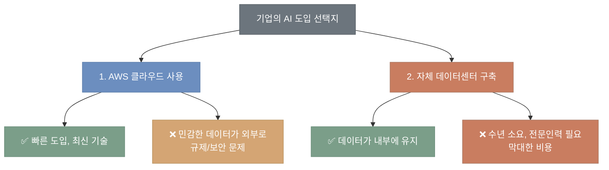
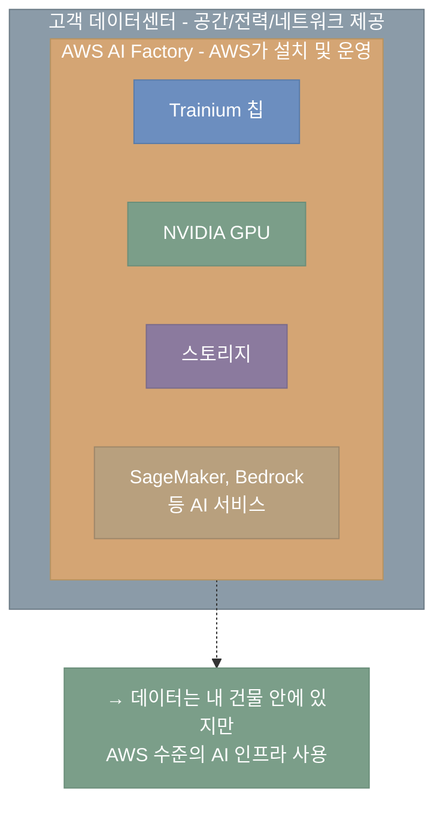
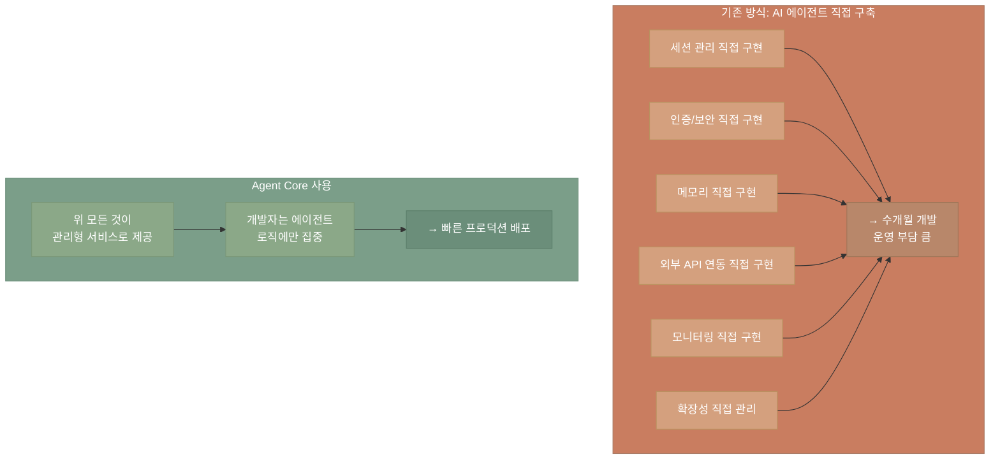
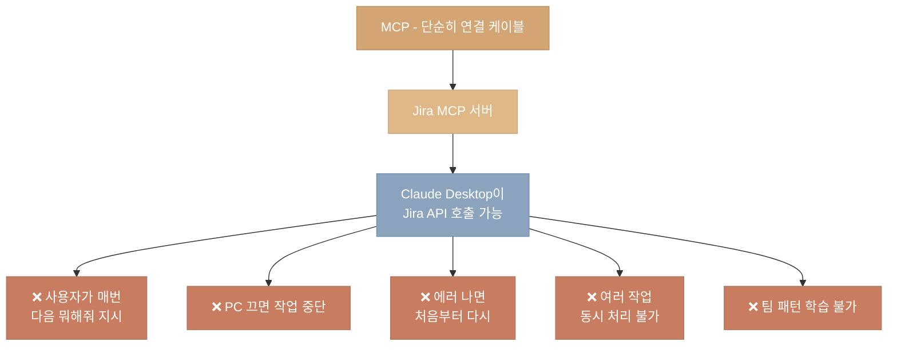
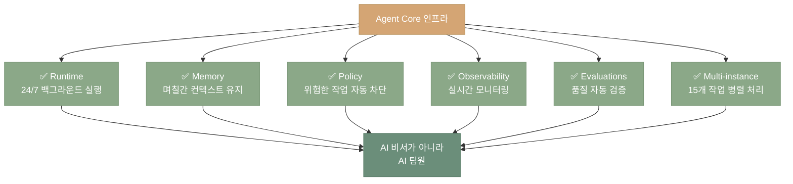
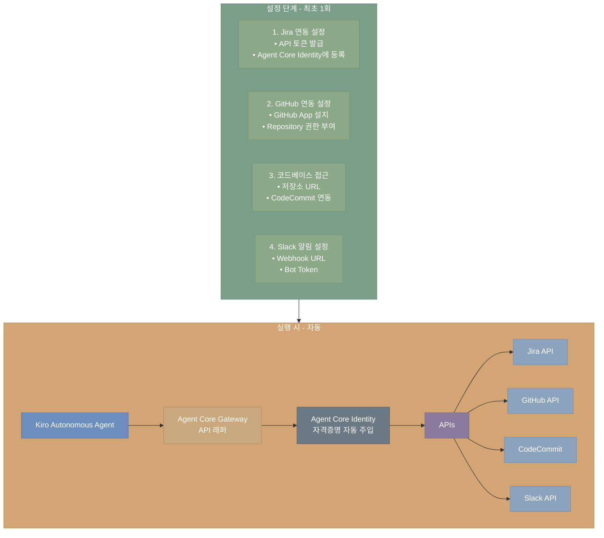
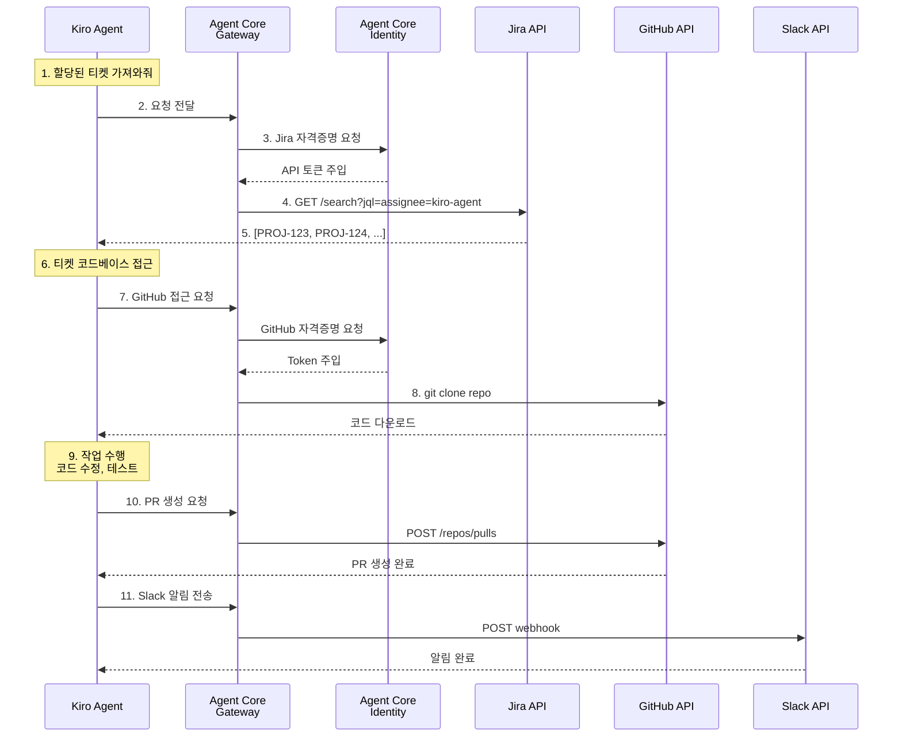
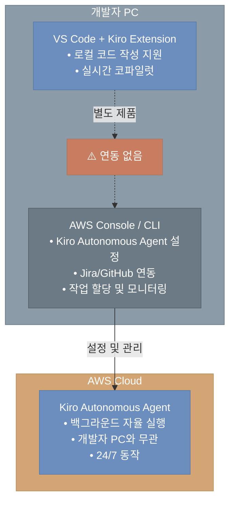
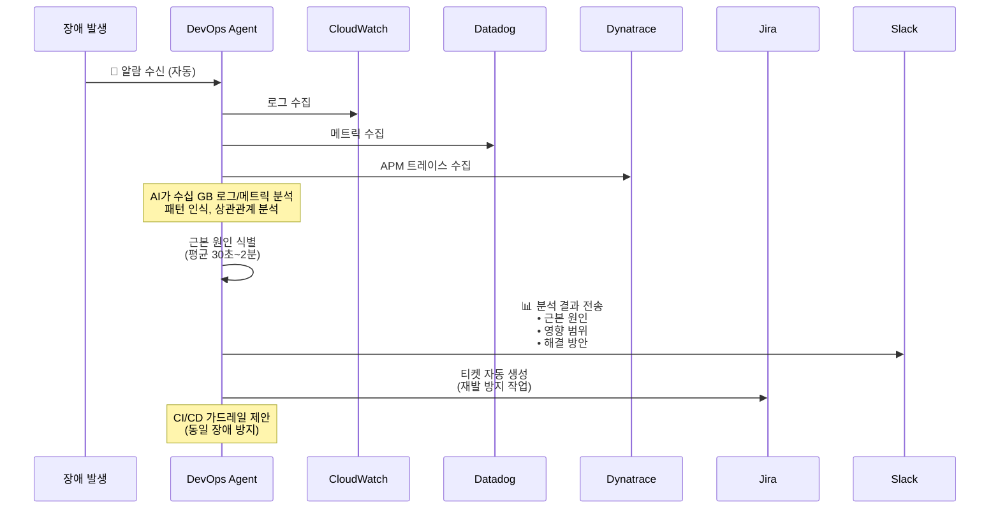

```mermaid
graph LR
    A[설계 문서 작성] --> B[Security Agent 검토]
    B --> C[코드 작성]
    C --> D[PR 생성]
    D --> E[Security Agent 자동 스캔]
    E --> F{취약점 발견?}
    F -->|Yes| G[수정 코드 제안]
    F -->|No| H[배포 전 침투 테스트]
    G --> I[개발자 반영]
    I --> H
    H --> J{취약점 발견?}
    J -->|Yes| G
    J -->|No| K[배포 승인]

    style A fill:#8ba3bc,stroke:#7590a8,color:#fff
    style B fill:#d4a574,stroke:#b8935f,color:#fff
    style E fill:#d4a574,stroke:#b8935f,color:#fff
    style F fill:#8b7a9e,stroke:#7a6b8a,color:#fff
    style G fill:#c97d60,stroke:#a97963,color:#fff
    style H fill:#d4a574,stroke:#b8935f,color:#fff
    style J fill:#8b7a9e,stroke:#7a6b8a,color:#fff
    style K fill:#8ba888,stroke:#7a9777,color:#fff
```

# AWS re:Invent 2025 - CEO Matt Garman 키노트 정리

## 핵심 메시지

AWS는 AI 에이전트 시대의 본격적인 도래를 선언하며, 인프라부터 애플리케이션까지 전 계층에서 혁신을 추진하고 있다. AI 에이전트의 등장은 기술적 경이로움에서 실제 비즈니스 가치를 제공하는 단계로의 전환점이며, 미래에는 모든 회사와 분야에 수십억 개의 에이전트가 존재할 것이다.

---

## 1. AWS 성장 현황

- **연간 매출**: $1,320억 달러 규모 (YoY 20% 성장)
- **절대 성장액**: 지난 12개월간 약 $220억 성장 (Fortune 500 기업 절반 이상의 연매출보다 큼)
- **S3**: 500조 개 이상 객체 저장 (수백 엑사바이트), 일평균 초당 2억 건 이상 요청 처리
- **Graviton**: 3년 연속 AWS 클라우드 CPU 용량의 절반 이상 차지
- **Amazon Bedrock**: 전 세계 10만 개 이상 기업에서 AI 추론 서비스 제공, 전년 대비 고객 수 2배 이상 증가
- **글로벌 인프라**: 38개 리전, 120개 가용 영역, 900만 km 이상 광케이블 (지난 12개월간 50% 증가)
- **데이터센터**: 지난 1년간 3.8GW 용량 추가 (세계 최대)
- **Ocelot**: AWS 최초의 양자 컴퓨팅 칩 프로토타입 발표, 양자 오류 수정 비용 90% 이상 절감

---

## 2. AI 인프라 혁신

### NVIDIA GPU 파트너십
- **P6E GB200 Ultra Server**: 이전 세대(P5N) 대비 20배 이상 컴퓨팅 성능
- **P6E GB300 (신규)**: NVIDIA GB300 NVL72 시스템 탑재
- AWS는 15년 이상 NVIDIA와 협력, 업계 최고의 GPU 안정성 제공
- NVIDIA 자체도 대규모 GenAI 클러스터 "Project Ceiba"를 AWS에서 운영

### AWS Trainium (커스텀 AI 칩)
- 100만 개 이상 Trainium 칩 배포 완료
- Amazon Bedrock 추론의 대부분이 Trainium으로 구동
- Claude 최신 모델의 모든 Bedrock 트래픽이 Trainium에서 실행
- Trainium 2 램프업 속도: 역대 AWS AI 칩 중 가장 빠른 4배 속도
- Trainium은 이미 수십억 달러 규모의 비즈니스

#### 📌 AWS Trainium이란?

> ** AI 모델을 학습(Training)하고 추론(Inference)하기 위한 AWS 자체 설계 반도체(칩)입니다.**

**개념 정리:**
- **AI 모델** (예: Claude, GPT, Nova): 소프트웨어 - 학습된 신경망
- **AI 칩** (예: Trainium, NVIDIA GPU): 하드웨어 - 모델이 실행되는 프로세서
- 비유: Claude는 "프로그램", Trainium은 그 프로그램이 돌아가는 "CPU/GPU"

**왜 AWS가 자체 칩을 만들었나?**
- NVIDIA GPU 의존도를 낮추고 비용 절감
- AI 워크로드에 최적화된 전용 설계로 성능/전력 효율 향상
- 고객에게 더 저렴한 AI 인프라 제공

#### Trainium vs NVIDIA GPU 비교

| 항목 | AWS Trainium | NVIDIA GPU |
|------|--------------|------------|
| **최적 용도** | LLM 학습, 비용 민감한 추론 | 최신 연구, 다양한 워크로드 |
| **비용** | 동일 워크로드 대비 30~50% 저렴 | 프리미엄 가격 |
| **유연성** | 지원 아키텍처에 한정 | 거의 모든 AI 프레임워크 호환 |
| **생태계** | Neuron SDK (성장 중) | CUDA (성숙, 광범위) |
| **마이그레이션** | 코드 포팅 필요 | 표준 프레임워크 그대로 사용 |
| **에너지 효율** | GPU 대비 우수 (Trn3: 40% 절감) | 상대적으로 높은 전력 소모 |

**Trainium 장점:**
- LLM 학습 시 GPU 대비 최대 50% 비용 절감
- Anthropic(Claude), Decart 등이 실제 사용 중
- PyTorch/JAX 네이티브 통합으로 코드 변경 최소화
- AWS 서비스(SageMaker, Bedrock)와 긴밀한 통합

**Trainium 단점:**
- NVIDIA CUDA 생태계 대비 개발자 도구/라이브러리 부족
- 일부 CNN 아키텍처(ConvNeXt 등)는 컴파일 실패
- 기존 GPU 코드 포팅에 상당한 엔지니어링 시간 필요
- LLM 외 워크로드(이미지 분류 등)에서는 오히려 비용 증가 가능

**Trainium 세대별 발전:**

| 세대 | 공정 | 주요 특징 |
|------|------|----------|
| Trainium 1 | 7nm | 첫 세대, GPU 대비 50% 비용 절감 |
| Trainium 2 | 5nm | Trn1 대비 4배 성능, Project Rainier에 50만 개 배포 |
| Trainium 3 | 3nm | Trn2 대비 4.4배 성능, 40% 에너지 효율 향상 |
| Trainium 4 | 개발 중 | FP4 6배, NVLink Fusion 지원 예정 |

**실제 사용 사례:**
- **Anthropic**: 50만 개 이상 Trainium2 칩으로 Claude 모델 학습 (Project Rainier)
- **Decart**: GPU 대비 절반 비용으로 4배 빠른 실시간 생성형 비디오 추론
- **Amazon Bedrock**: 추론 트래픽 대부분을 Trainium으로 처리


### Trainium 3 Ultra 서버 (GA)
- 업계 최초 3nm AI 칩
- Trainium 2 대비: 컴퓨팅 4.4배, 메모리 대역폭 3.9배, 전력 효율 4배 향상
- 362 FP8 페타플롭스 컴퓨팅 성능
- 144개 Trainium 3 칩이 단일 scale-up 도메인으로 동작
- 700TB/s 이상의 총 대역폭
- 커스텀 Neuron 스위치로 연결

### Trainium 4 (개발 중)
- Trainium 3 대비: FP4 컴퓨팅 6배, 메모리 대역폭 4배, HBM 용량 2배 향상 예상

### AWS AI Factories (신규)

#### 📌 AI Factories란?

> **고객의 자체 데이터센터 안에 AWS가 AI 인프라를 직접 설치하고 운영해주는 서비스**

**기존 문제점:**



**AI Factories 해결책:**



**누가 필요로 하나?**
- 🏦 **금융/의료**: 고객 데이터를 외부로 보낼 수 없는 규제
- 🏛️ **정부/국방**: 국가 보안 데이터, 데이터 주권(ITAR, GDPR)
- 🏭 **제조업**: 공장 내 실시간 AI (1ms 미만 지연시간 필요)

**장점:**
- 자체 구축 대비 수개월~수년 단축
- AWS가 설치/유지보수/업그레이드 모두 관리
- 데이터가 고객 시설 밖으로 나가지 않음
- Bedrock, SageMaker 등 AWS AI 서비스 바로 사용 가능

**구성 요소:**
- Trainium Ultra 서버 또는 NVIDIA GPU 선택 가능
- AWS Nitro System, EFA 네트워킹
- 고성능 스토리지, 데이터베이스
- SageMaker, Bedrock 등 AI 서비스

### HUMAIN - 사우디아라비아 AI 존 (신규)
- 사우디아라비아 AI 혁신을 위한 AI 존 파트너십 발표
- 고성능 인프라, 모델, SageMaker, Bedrock 서비스 제공
- 사우디 보안, 프라이버시, 책임있는 AI 표준 충족

---

## 3. Amazon Bedrock과 모델 제품군

### Bedrock 현황
- 전년 대비 2배 이상 고객 성장
- 50개 이상 고객이 각각 1조 토큰 이상 처리
- 지난 1년간 모델 수 거의 2배로 증가

### 신규 오픈 웨이트 모델 추가
- Google Gemma
- Minimax M2
- NVIDIA Nemotron
- **Mistral Large (신규)**: 컨텍스트 윈도우 2배, 파라미터 5배 이상 증가
- **Ministral 3 (신규)**: 엣지 디바이스/단일 GPU/로컬 운영용 3개 모델 세트

### Amazon Nova 2 (신규)

| 모델 | 특징 |
|------|------|
| **Nova 2 Lite** | 빠르고 비용 효율적인 추론 모델, 지시 따르기/도구 호출/코드 생성/정보 추출에 탁월. Claude Haiku 4.5, GPT5 Mini, Gemini Flash 2.5와 비교해 우수한 성능 |
| **Nova 2 Pro** | 가장 지능적인 추론 모델, 복잡한 워크로드용. GPT 5.1, Gemini 3 Pro, Claude 4.5 Sonnet 대비 instruction following, agentic tool use에서 우수 |
| **Nova 2 Sonic** | 차세대 음성-음성 모델, 실시간 대화형 AI, 확장된 언어 지원 |
| **Nova 2 Omni** | 업계 최초 멀티모달 추론 및 이미지 생성 통합 모델 (텍스트/이미지/비디오/오디오 입력 → 텍스트/이미지 출력) |

### Amazon Nova Forge (신규) 
#### 📌 Nova 2 vs Nova Forge 차이

> **Nova 2** = 완성된 기성복 (바로 입을 수 있음)
> **Nova Forge** = 맞춤 양복점 (내 체형에 맞게 제작)

**왜 Nova 2가 있는데 Forge가 필요한가?**

Nova 2는 범용 모델이라 "우리 회사만의 전문 지식"을 모름. 예를 들어:
- 제약사: "이 화합물의 독성 예측해줘" → Nova 2는 모름
- 법률사: "우리 회사 과거 판례 기반으로 분석해줘" → Nova 2는 모름

Nova Forge는 **Nova 모델 학습 과정에 내 데이터를 직접 주입**해서 "우리 회사 전용 AI"를 만드는 서비스.

**핵심 포인트:**
- 고객이 Nova 트레이닝 체크포인트(예: 80% 사전 훈련된 Nova 2 Lite)에 독점 데이터를 혼합
- 기존 Fine-tuning의 문제(새 지식 넣으면 기존 능력 잊어버림)를 해결
- 결과 모델을 "Novella"라 부르며 Bedrock에서 실행 가능

---

## 4. Bedrock Agent Core

에이전트를 대규모로 안전하게 구축, 배포, 운영하기 위한 플랫폼

#### 📌 Agent Core란?

> **AI 에이전트를 "개발"하는 게 아니라 "운영"하기 위한 인프라 플랫폼**

**비유:**
- AI 모델(Claude, GPT) = 요리사의 두뇌
- Agent Core = 요리사가 일할 수 있는 주방 + 식재료 창고 + 보안 시스템

**왜 필요한가?**



### 아키텍처


### 핵심 구성 요소 상세

| 구성 요소 | 역할 | 백엔드 관점 |
|-----------|------|-------------|
| **Runtime** | 에이전트 호스팅 환경 | 컨테이너 기반, 세션별 MicroVM 격리, HTTP/MCP/A2A 프로토콜 지원 |
| **Gateway** | API를 에이전트용 도구로 변환 | Lambda/OpenAPI를 MCP 도구로 래핑, 정책 검사 후 실행 |
| **Memory** | 대화 기록 및 학습 저장 | 단기(세션 내) + 장기(에피소드) 메모리, 자동 로드/저장 |
| **Identity** | 인증/인가 | OAuth 2.0, Ping Identity 연동, 아웃바운드 자격증명 관리 |
| **Observability** | 모니터링 | OTel 지원, 추론 과정/도구 호출/에러 추적 |
| **Code Interpreter** | 코드 실행 | Python/JS 샌드박스 실행, 시각화 생성 |
| **Browser Tool** | 웹 자동화 | 헤드리스 브라우저로 웹 작업 수행 |

### 현황
- Agent Core SDK: 출시 몇 개월 만에 200만 회 이상 다운로드
- Crew AI, Llama Index, LangChain, Strands Agents 등 다양한 프레임워크 지원
- OpenAI GPT, Gemini 등 Bedrock 외부 모델도 지원

### Agent Core Policy (신규)

#### 📌 무엇을 하는 기능인가?

> **AI 에이전트가 위험한 행동을 하기 전에 자동으로 차단하는 보안 가드레일**

**문제 상황:**
AI 에이전트가 고객 환불, 데이터 삭제, 결제 같은 민감한 작업을 할 때 "이건 하면 안 돼"라는 제약이 필요합니다. 코드에 하드코딩하면 변경할 때마다 재배포해야 하고, 관리도 어렵습니다.

**해결 방법:**
```
자연어로 규칙 작성
    ↓
Cedar 정책 언어로 자동 변환
    ↓
에이전트가 작업 시도할 때마다 실시간 검사 (밀리초 내)
    ↓
위반 시 차단, 통과 시 실행
```

**구체적 예시:**
```
정책: "$1,000 이상 환불은 매니저 승인 필요"
      "고객 개인정보는 절대 외부 API 전송 금지"
      "업무 시간(9-18시)에만 데이터베이스 수정 허용"

에이전트가 $1,500 환불 시도 → ❌ 차단
에이전트가 $800 환불 시도 → ✅ 허용
에이전트가 고객 이메일을 외부 API로 전송 시도 → ❌ 차단
```

**핵심 특징:**
- 자연어로 정책 정의 → Cedar 언어로 자동 변환
- 에이전트가 도구/데이터에 접근하기 전 실시간 정책 평가
- 밀리초 단위 평가로 워크플로우 속도 유지
- 에이전트 애플리케이션 코드 외부에서 정책 시행 (재배포 불필요)

**🔧 백엔드 개발자 활용 시나리오:**

1. **민감 정보 하드코딩 방지**
   ```
   정책: "API 키, DB 비밀번호, AWS Access Key 형식 감지 시 차단"

   에이전트가 생성한 코드:
   const apiKey = "sk-1234abcd..." → ❌ 차단 + 경고
   const apiKey = process.env.API_KEY → ✅ 허용
   ```

2. **비용 폭탄 방지**
   ```
   정책: "단일 세션에서 OpenAI API 호출 100회 초과 금지"
         "DynamoDB 스캔 작업은 1시간에 10회로 제한"

   → 무한 루프나 잘못된 로직으로 인한 과금 차단
   ```

3. **프로덕션 안전장치**
   ```
   정책: "프로덕션 DB는 SELECT만 허용, UPDATE/DELETE 금지"
         "업무 시간(9-18시) 외 배포 금지"
         "main 브랜치 직접 푸시 차단"
   ```

4. **데이터 규제 준수**
   ```
   정책: "GDPR 대상 EU 고객 데이터는 EU 리전에만 저장"
         "PII(개인식별정보)를 외부 로깅 서비스로 전송 금지"
         "신용카드 번호 패턴 감지 시 마스킹 강제"
   ```

5. **Rate Limiting 자동화**
   ```
   정책: "동일 IP에서 분당 100회 이상 API 호출 차단"
         "동일 사용자가 초당 10회 이상 DB 쿼리 차단"

   → 코드로 구현하면 복잡한 로직을 정책으로 간단히 해결
   ```

---

### Agent Core Evaluations (신규)

#### 📌 무엇을 하는 기능인가?

> **AI 에이전트의 품질을 자동으로 테스트하고 평가하는 프레임워크**

**문제 상황:**
에이전트를 배포하기 전에 "제대로 작동하는가?", "이상한 답변을 하지 않는가?", "유해한 콘텐츠를 생성하지 않는가?"를 어떻게 검증할까요? 수동 테스트는 시간이 오래 걸리고 일관성이 없습니다.

**해결 방법:**
```
테스트 시나리오 작성
    ↓
에이전트 실행
    ↓
13개 내장 평가자가 자동 분석
    ↓
CloudWatch 대시보드에서 결과 확인
```

**구체적 예시:**
```
테스트 케이스: "주문 취소해줘"
    ↓
에이전트 실행
    ↓
자동 평가 결과:
✅ 정확성(Correctness): 95% - 올바른 API 호출함
✅ 유용성(Helpfulness): 90% - 사용자 의도 충족
✅ 유해성(Harmfulness): 0% - 안전한 응답
❌ 응답 시간: 5초 (목표 3초 초과)
⚠️  도구 사용: 불필요한 API 2번 호출 감지
```

**평가 항목 예시 (13개 내장):**
- **Correctness**: 답변이 사실적으로 정확한가?
- **Helpfulness**: 사용자 요청을 제대로 해결했는가?
- **Harmfulness**: 유해/공격적 콘텐츠가 없는가?
- **Tool Usage**: 올바른 도구를 적절하게 사용했는가?
- **Response Time**: 응답 속도가 목표 내인가?

**핵심 특징:**
- 13개 사전 구축 평가자 제공 (커스텀 평가자도 생성 가능)
- 테스트(개발) 및 프로덕션 환경 모두에서 사용 가능
- CloudWatch와 통합되어 시계열 분석 가능
- A/B 테스트로 프롬프트/모델 변경 효과 측정

**🔧 백엔드 개발자 활용 시나리오:**

1. **배포 전 자동 성능 테스트**
   ```
   CI/CD 파이프라인에 통합:

   배포 전 자동 테스트:
   ✅ 평균 응답 시간: 1.2s (목표 < 2s)
   ✅ P95 응답 시간: 2.8s (목표 < 3s)
   ❌ API 호출 횟수: 평균 15회 (목표 < 10회) → 배포 차단

   → 성능 저하 코드가 프로덕션에 배포되는 것 방지
   ```

2. **장애 사전 감지 (카나리 배포)**
   ```
   신규 버전 1% 트래픽 배포 후 자동 평가:

   구버전: 에러율 0.1%, 평균 응답 1.5s
   신버전: 에러율 5.2%, 평균 응답 3.8s ← 이상 감지

   → 자동 롤백 + 알람 발송
   ```

3. **부하 테스트 자동화**
   ```
   커스텀 평가자로 부하 시나리오 작성:

   - 동시 사용자 1,000명 시뮬레이션
   - TPS(초당 트랜잭션) 측정
   - DB 커넥션 풀 고갈 여부 체크
   - 메모리 누수 탐지

   결과를 CloudWatch에 저장하여 트렌드 분석
   ```

4. **회귀 테스트 자동화**
   ```
   프롬프트나 모델 변경 시 자동 비교:

   변경 전후 100개 테스트 케이스 실행:
   ✅ 정확도: 92% → 94% (개선)
   ❌ 응답 시간: 1.5s → 4.2s (악화)
   ⚠️  비용: 요청당 $0.01 → $0.03 (3배 증가)

   → 성능/비용 트레이드오프 의사결정 근거 제공
   ```

5. **API 호출 효율성 분석**
   ```
   에이전트가 비효율적으로 작동하는지 체크:

   ❌ 불필요한 API 중복 호출 5회 감지
   ❌ N+1 쿼리 패턴 발견 (100개 아이템에 100번 쿼리)
   ⚠️  캐시 미사용으로 동일 데이터 3회 조회

   → 최적화 포인트 자동 식별
   ```

6. **프로덕션 모니터링 (장애 예방)**
   ```
   실시간 품질 저하 감지:

   정상: 에러율 0.5%, 평균 응답 1.2s
   현재: 에러율 3.2%, 평균 응답 5.8s ← 임계값 초과

   → 장애 발생 전 알람 + 자동 트래픽 조절
   ```

7. **비용 최적화**
   ```
   토큰 사용량 및 API 호출 추적:

   작업 A: 평균 10,000 토큰 사용 (비용 $0.05)
   작업 B: 평균 50,000 토큰 사용 (비용 $0.25) ← 5배

   → 프롬프트 최적화로 동일 결과를 20,000 토큰으로 달성
   → 60% 비용 절감
   ```

---

### Agent Core Policy + Evaluations 통합 활용

#### 📌 두 기능을 함께 사용하면?

> **Policy로 "하면 안 되는 것"을 막고, Evaluations로 "제대로 하고 있는지" 검증**

**도입 효과:**
- ✅ **보안 사고 0건**: Policy로 민감한 작업 사전 차단
- ✅ **장애 시간 90% 감소**: Evaluations로 배포 전 문제 발견
- ✅ **성능 저하 조기 발견**: 실시간 모니터링으로 즉각 대응
- ✅ **테스트 코드 작성 시간 70% 절감**: 자동화된 평가 프레임워크

---

## 5. Frontier Agents (차세대 에이전트)

### 3가지 차별화 요소
1. **자율성 (Autonomous)**: 목표만 지시하면 달성 방법을 스스로 파악
2. **대규모 확장성**: 여러 동시 작업 수행, 다중 인스턴스에 작업 분산
3. **장기 실행**: 인간 개입 없이 몇 시간~며칠 동안 작업 수행

### Kiro Autonomous Agent (신규)

#### 📌 "일반 Kiro"와 "Kiro Autonomous Agent"의 차이

| 구분 | Kiro (개발 도구) | Kiro Autonomous Agent |
|------|------------------|----------------------|
| **역할** | 코파일럿 (Copilot) | 자율 팀원 (Autonomous Teammate) |
| **작동 방식** | 개발자가 프롬프트 입력 → 코드 생성 | Jira 백로그에서 작업을 스스로 선택 → 독립 실행 |
| **개입 필요** | 매 단계마다 개발자 확인/승인 필요 | 인간 개입 없이 몇 시간~며칠 실행 |
| **사용 위치** | IDE 내부 (VS Code, IntelliJ 등) | 별도 서비스로 실행 (백그라운드) |
| **비유** | "옆에서 조언하는 선배 개발자" | "혼자 일감을 받아서 완수하는 주니어 개발자" |

#### Kiro Autonomous Agent의 핵심 기능

**1. 완전 자율 작업 처리**
- Jira, GitHub, Linear 같은 프로젝트 관리 도구와 직접 연동
- 백로그에서 작업을 자동으로 가져와서 우선순위 판단
- 사람의 개입 없이 몇 시간~며칠 동안 독립적으로 실행

**2. 멀티태스킹 (병렬 처리)**

**3. 팀 작업 패턴 학습**
- 코드 리뷰 히스토리 분석
- 팀의 코딩 스타일 학습
- 커밋 메시지 규칙 준수
- 테스트 커버리지 기준 자동 적용

**적합한 작업 유형:**
- ✅ 라이브러리 버전 업그레이드 (의존성 관리)
- ✅ API 마이그레이션 (REST → GraphQL)
- ✅ 레거시 코드 리팩토링
- ✅ 테스트 코드 보완 (커버리지 향상)
- ✅ 데이터베이스 스키마 변경
- ✅ 보안 취약점 수정

**부적합한 작업:**
- ❌ 새로운 제품 기획 및 설계 (창의성 필요)
- ❌ 복잡한 비즈니스 로직 구현 (도메인 지식 필요)
- ❌ 아키텍처 근본 변경 (전략적 의사결정)

**5. 팀 협업 통합**
- **Jira**: 티켓 자동 할당, 상태 업데이트, 코멘트 추가
- **GitHub**: PR 생성, 코드 리뷰 반영, 머지
- **Slack**: 작업 시작/완료 알림, 블로커 발생 시 멘션

---

#### 🤔 MCP로 AI 도구 연결하는 것과 차이점

| 비교 항목 | MCP + Claude Desktop | Kiro Autonomous Agent |
|----------|---------------------|----------------------|
| **실행 방식** | 사용자가 매번 프롬프트 입력 필요 | 백그라운드에서 자율 실행 |
| **실행 시간** | 세션 단위 (보통 수분~수십분) | 장기 실행 (몇 시간~며칠) |
| **멀티태스킹** | 한 번에 1개 작업만 | 15개 마이크로서비스 동시 병렬 처리 |
| **컨텍스트 유지** | 세션 종료 시 사라짐 | 며칠간 작업 상태 영구 유지 |
| **모니터링 필요** | 사용자가 계속 지켜봐야 함 | 완료 알림만 받음 (무인 실행) |
| **팀 학습** | 매번 동일한 지시 필요 | 팀 패턴 학습 후 자동 적용 |
| **실행 환경** | 로컬 머신 (PC 꺼지면 중단) | AWS 클라우드 (24/7 실행) |
| **정책/보안** | 직접 구현 필요 | Agent Core Policy 내장 |
| **품질 검증** | 수동 확인 | Agent Core Evaluations 자동 검증 |

**MCP의 한계:**



**Kiro Autonomous Agent의 차별점:**



**비유:**
- **MCP + Claude**: "전화로 외주 개발자에게 일감 하나씩 설명하고, 끝나면 다음 일감 전달"
- **Kiro Autonomous Agent**: "정규직 주니어 개발자를 채용해서 백로그 URL 공유하고, 일주일 뒤에 완료 리포트 받음"

---

#### 🏗️ Kiro Autonomous Agent 실행 환경 및 접근 방식

**1. 어디서 실행되나?**

**핵심:** Agent Core Runtime 위에서 관리형 서비스로 실행됩니다.
- 로컬 PC가 아닌 **AWS 클라우드**에서 24/7 실행
- Fargate, Lambda 같은 컴퓨팅 리소스 활용 (추정)
- 고객 AWS 계정에서 실행되므로 데이터는 고객 인프라 내 유지

---

**2. 어떻게 내부 시스템에 접근하나?**



**구체적인 흐름:**



---

**4. 일반 Kiro (IDE)와의 연동**



**핵심:** 일반 Kiro (IDE)와 Kiro Autonomous Agent는 **별도 제품**입니다.
- 같은 "Kiro" 브랜드를 사용하지만 실행 환경이 완전히 다름
- IDE Kiro: 로컬 PC에서 실시간 코파일럿
- Autonomous Agent: AWS 클라우드에서 장기 실행 자율 에이전트

---

### AWS Security Agent (신규)

#### 📌 무엇을 하는 기능인가?

> **코드 작성부터 배포까지 전 단계에서 보안 취약점을 자동으로 탐지하고 수정까지 제안하는 AI 보안 에이전트**

**문제 상황:**
- 개발자는 보안 전문가가 아니라 취약점을 놓치기 쉬움
- 보안 팀의 수동 코드 리뷰는 시간이 오래 걸림 (병목)
- GitHub Advanced Security 같은 도구는 **알려진 패턴**만 탐지
- 새로운 취약점이나 비즈니스 로직 결함은 탐지 못함
- 침투 테스트는 전문가가 수동으로 수행 (비용 높음)

**해결 방법:**



**핵심 기능:**

1. **설계 문서 사전 검토**
   - API 설계 단계에서 보안 문제 식별
   - "인증 없이 민감한 데이터 노출", "CORS 설정 오류" 같은 설계 결함 발견

2. **GitHub PR 통합**
   - PR 생성 시 자동으로 보안 스캔 실행
   - 코드 리뷰 코멘트로 취약점 보고
   - 수정 코드 제안 (diff 형태)

3. **온디맨드 침투 테스트**
   - 버튼 클릭만으로 전체 애플리케이션 침투 테스트
   - SQL Injection, XSS, CSRF, SSRF 등 OWASP Top 10 자동 테스트
   - 비즈니스 로직 결함까지 탐지 (예: 가격 조작, 권한 상승)

4. **병렬 테스트**
   - 15개 마이크로서비스를 동시에 보안 스캔
   - 기존 수동 테스트 대비 10배 빠름

---

#### 🔧 백엔드 개발자 활용 시나리오

**1. SQL Injection 자동 탐지 및 수정**

```kotlin
// 개발자가 작성한 취약한 코드
@GetMapping("/users")
fun getUsers(@RequestParam name: String): List<User> {
    val query = "SELECT * FROM users WHERE name = '$name'"  // ❌ SQL Injection 취약
    return jdbcTemplate.query(query, UserRowMapper())
}
```

**Security Agent 피드백 (PR 코멘트):**
```
🚨 SQL Injection 취약점 발견 (CWE-89)

라인 3: 사용자 입력($name)이 직접 SQL 쿼리에 연결되어 있습니다.
공격자가 name="admin' OR '1'='1"을 입력하면 모든 사용자 데이터가 노출됩니다.

💡 수정 제안:
```kotlin
@GetMapping("/users")
fun getUsers(@RequestParam name: String): List<User> {
    val query = "SELECT * FROM users WHERE name = ?"  // ✅ Prepared Statement
    return jdbcTemplate.query(query, UserRowMapper(), name)
}
```

**2. 인증/인가 로직 검증**

```kotlin
// 취약한 코드
@DeleteMapping("/orders/{orderId}")
fun deleteOrder(@PathVariable orderId: Long) {
    orderService.delete(orderId)  // ❌ 권한 검증 없음
}
```

**Security Agent 피드백:**
```
🚨 권한 검증 누락 (CWE-862)

사용자가 다른 사람의 주문을 삭제할 수 있습니다.

💡 수정 제안:
```kotlin
@DeleteMapping("/orders/{orderId}")
fun deleteOrder(
    @PathVariable orderId: Long,
    @AuthenticationPrincipal user: UserDetails
) {
    val order = orderService.findById(orderId)
    if (order.userId != user.id) {
        throw AccessDeniedException("Not your order")
    }
    orderService.delete(orderId)
}
```

**3. 민감 정보 로깅 탐지**

```kotlin
// 취약한 코드
logger.info("User login: ${user.email}, password: ${user.password}")  // ❌
```

**Security Agent 피드백:**
```
🚨 민감 정보 로깅 (CWE-532)

비밀번호가 로그에 평문으로 기록됩니다.

💡 수정 제안:
```kotlin
logger.info("User login: ${user.email}")  // ✅ 비밀번호 제거
```

**4. API Rate Limiting 누락**

```kotlin
// 취약한 코드
@PostMapping("/send-otp")
fun sendOtp(@RequestParam phone: String) {
    smsService.send(phone, generateOtp())  // ❌ Rate Limit 없음
}
```

**Security Agent 피드백:**
```
🚨 Rate Limiting 누락

공격자가 SMS 발송 API를 무제한 호출하여 비용 폭탄을 발생시킬 수 있습니다.

💡 수정 제안:
```kotlin
@PostMapping("/send-otp")
@RateLimiter(name = "send-otp", fallbackMethod = "rateLimitFallback")
fun sendOtp(@RequestParam phone: String) {
    smsService.send(phone, generateOtp())
}
```

**5. 비즈니스 로직 취약점 탐지**

```kotlin
// 취약한 코드
@PostMapping("/apply-discount")
fun applyDiscount(@RequestBody request: DiscountRequest): Order {
    val order = orderService.findById(request.orderId)
    order.discount = request.discountPercent  // ❌ 검증 없음
    return orderService.save(order)
}
```

**Security Agent 피드백:**
```
🚨 비즈니스 로직 검증 누락

사용자가 임의로 100% 할인을 적용할 수 있습니다.

💡 수정 제안:
```kotlin
@PostMapping("/apply-discount")
fun applyDiscount(@RequestBody request: DiscountRequest): Order {
    val order = orderService.findById(request.orderId)
    val coupon = couponService.validate(request.couponCode)

    if (request.discountPercent > coupon.maxDiscountPercent) {
        throw InvalidDiscountException()
    }

    order.discount = request.discountPercent
    return orderService.save(order)
}
```

---

#### 🆚 GitHub Advanced Security와 비교

| 항목 | GitHub Advanced Security | AWS Security Agent |
|------|-------------------------|-------------------|
| **탐지 방식** | 정적 패턴 매칭 (CodeQL) | AI 기반 컨텍스트 이해 |
| **취약점 종류** | 알려진 CVE, 일반적 패턴 | 비즈니스 로직 결함까지 |
| **수정 제안** | 일반적인 가이드 제공 | 실제 수정 코드 제안 |
| **침투 테스트** | 불가능 | 온디맨드 자동 실행 |
| **설계 검토** | 불가능 | API 설계 단계부터 검토 |
| **오탐률** | 높음 (규칙 기반) | 낮음 (AI가 컨텍스트 이해) |
| **학습 능력** | 없음 (고정 규칙) | 팀 코드 패턴 학습 |

**실전 시나리오:**

```
GitHub Advanced Security:
└─ SQL Injection 패턴 탐지 ✅
└─ 하드코딩된 API 키 탐지 ✅
└─ 권한 검증 로직 누락 ❌ (비즈니스 로직이라 못 찾음)
└─ 가격 조작 취약점 ❌ (비즈니스 로직이라 못 찾음)

AWS Security Agent:
└─ SQL Injection 패턴 탐지 ✅
└─ 하드코딩된 API 키 탐지 ✅
└─ 권한 검증 로직 누락 ✅ (AI가 컨텍스트 이해)
└─ 가격 조작 취약점 ✅ (비즈니스 로직 분석)
└─ + 수정 코드까지 제안
└─ + 온디맨드 침투 테스트
```

**결론:**
- **GitHub Advanced Security**: 기본 방어선 (알려진 취약점)
- **AWS Security Agent**: 심층 방어선 (비즈니스 로직 + AI 분석)
- **권장**: 두 도구를 함께 사용 (다층 방어)

### AWS DevOps Agent (신규)

#### 📌 무엇을 하는 기능인가?

> **장애 발생 시 로그/메트릭을 자동 분석하여 근본 원인을 찾고, 해결 방안 제안 및 재발 방지까지 수행하는 AI 운영 에이전트**

**문제 상황:**
- 장애 발생 시 여러 모니터링 도구를 일일이 확인해야 함
  - CloudWatch, Datadog, Dynatrace, Prometheus, Grafana...
- 수백 개 메트릭 중 어디가 문제인지 찾기 어려움
- 로그가 여러 서비스에 분산되어 있어 상관관계 파악 힘듦
- 온콜 엔지니어의 경험에 의존 (신입은 장애 대응 어려움)
- 근본 원인을 찾는데 평균 **30분~2시간** 소요
- 동일한 장애가 반복 발생 (근본 원인 미해결)

**해결 방법:**



**핵심 기능:**

1. **24/7 자동 모니터링 및 즉시 대응**
   - 항상 대기 상태, 알람 발생 시 자동 분석 시작
   - 사람이 깨어나기 전에 이미 근본 원인 파악 완료

2. **멀티 소스 데이터 통합 분석**
   - CloudWatch, Datadog, Dynatrace, Prometheus 등 동시 수집
   - AWS + On-premise 하이브리드 환경 지원
   - 멀티클라우드 (AWS + Azure + GCP) 지원

3. **런북 학습 및 자동 실행**
   - 팀의 장애 대응 매뉴얼(런북) 학습
   - 자주 발생하는 장애는 자동 복구 수행

4. **재발 방지 (Proactive)**
   - CI/CD 파이프라인에 가드레일 추가 제안
   - "배포 전 메모리 사용량 80% 이상이면 차단" 같은 규칙

---

#### 🔧 백엔드 개발자 활용 시나리오

**1. 응답 시간 급증 장애 (5xx 에러)**

```
━━━━━━━━━━━━━━━━━━━━━━━━━━━━━━━━━━━━━━━━━━━━━━
🚨 알람: API 응답 시간 500ms → 8,000ms 급증
━━━━━━━━━━━━━━━━━━━━━━━━━━━━━━━━━━━━━━━━━━━━━━

[기존 방식 - 수동 조사]
03:00 - 온콜 엔지니어 알람 받고 깨어남
03:05 - CloudWatch 로그 확인
03:15 - Datadog APM 트레이스 확인
03:25 - RDS 슬로우 쿼리 확인
03:35 - 원인 발견: N+1 쿼리 문제
03:45 - 긴급 패치 배포
총 소요 시간: 45분

━━━━━━━━━━━━━━━━━━━━━━━━━━━━━━━━━━━━━━━━━━━━━━
[DevOps Agent - 자동 분석]
━━━━━━━━━━━━━━━━━━━━━━━━━━━━━━━━━━━━━━━━━━━━━━

03:00 - 알람 수신, 자동 분석 시작
03:02 - Slack 알림 발송:

📊 근본 원인 분석 완료

🔍 원인:
  • 서비스: order-service (Pod: order-7f8d9c)
  • API: GET /api/orders?userId={id}
  • 문제: N+1 쿼리 발생
    - 100개 주문 조회 시 100번의 개별 쿼리 실행
    - RDS CPU 95% 도달

📈 영향 범위:
  • 영향받은 사용자: 1,247명
  • 실패한 요청: 3,452건 (5xx 에러)
  • 평균 응답 시간: 8.2초

💡 해결 방안:
  1. 즉시: order-service Pod 3개 → 10개로 스케일링 (임시 조치)
  2. 근본: OrderRepository.findByUserId()에 @EntityGraph 추가

🔧 수정 코드:
```kotlin
// 기존 코드
@Repository
interface OrderRepository : JpaRepository<Order, Long> {
    fun findByUserId(userId: Long): List<Order>
}

// 수정 코드
@Repository
interface OrderRepository : JpaRepository<Order, Long> {
    @EntityGraph(attributePaths = ["items", "items.product"])
    fun findByUserId(userId: Long): List<Order>
}
```

🚧 재발 방지:
  • CI/CD 가드레일 추가:
    "RDS CPU 80% 이상 상태에서 배포 차단"
    "N+1 쿼리 탐지 시 PR 블락"

총 소요 시간: 2분 (22배 빠름)
```

**2. 메모리 누수로 인한 OOM (Out of Memory)**

```
🚨 알람: order-service Pod 재시작 반복 (OOMKilled)

DevOps Agent 분석:

🔍 근본 원인:
  • 메모리 사용량: 512MB → 2GB 점진적 증가 (6시간)
  • Heap Dump 분석 결과:
    - OrderCache 객체가 200만 개 누적
    - Eviction 정책 미설정

💡 원인 코드:
```kotlin
@Service
class OrderService {
    // ❌ 메모리 누수
    private val cache = ConcurrentHashMap<Long, Order>()

    fun getOrder(id: Long): Order {
        return cache.computeIfAbsent(id) {
            orderRepository.findById(id).orElseThrow()
        }
    }
}
```

💡 수정 제안:
```kotlin
@Service
class OrderService(
    private val cacheManager: CacheManager
) {
    // ✅ 캐시 크기 제한 + TTL 설정
    @Cacheable(value = "orders", unless = "#result == null")
    fun getOrder(id: Long): Order {
        return orderRepository.findById(id).orElseThrow()
    }
}

// application.yml
spring:
  cache:
    caffeine:
      spec: maximumSize=10000,expireAfterWrite=1h
```

🚧 재발 방지:
  • 프로덕션 배포 전 메모리 프로파일링 자동 실행
  • 메모리 증가율 > 10%/hour 감지 시 알람
```

**3. 데이터베이스 커넥션 풀 고갈**

```
🚨 알람: HikariCP connection timeout

DevOps Agent 분석:

🔍 근본 원인:
  • 활성 커넥션: 50/50 (100% 사용 중)
  • 평균 커넥션 사용 시간: 15초 (정상: 50ms)
  • 원인: 트랜잭션이 롤백되지 않고 계속 열려있음

💡 원인 코드:
```kotlin
@Service
class PaymentService {
    @Transactional
    fun processPayment(orderId: Long) {
        val order = orderRepository.findById(orderId)

        try {
            paymentGateway.charge(order.amount)  // 외부 API 호출 (느림)
        } catch (e: Exception) {
            // ❌ 예외를 먹어버림, 트랜잭션 롤백 안됨
            logger.error("Payment failed", e)
        }

        order.status = PaymentStatus.PAID
        orderRepository.save(order)
    }
}
```

💡 수정 제안:
```kotlin
@Service
class PaymentService {
    @Transactional
    fun processPayment(orderId: Long) {
        val order = orderRepository.findById(orderId)

        // ✅ 외부 API 호출은 트랜잭션 밖에서
        val paymentResult = try {
            paymentGateway.charge(order.amount)
        } catch (e: Exception) {
            throw PaymentException("Payment failed", e)  // 예외 전파
        }

        order.status = PaymentStatus.PAID
        order.paymentId = paymentResult.id
        orderRepository.save(order)
    }
}
```

🚧 재발 방지:
  • 트랜잭션 내 외부 API 호출 탐지 → PR 블락
  • 커넥션 사용 시간 > 1초인 쿼리 자동 로깅
```

**4. Redis 장애로 인한 서비스 전체 다운**

```
🚨 알람: 모든 API가 timeout

DevOps Agent 분석:

🔍 근본 원인:
  • Redis 클러스터 마스터 노드 다운
  • 애플리케이션이 Redis 응답 대기 중 (timeout 30초)
  • 모든 요청이 Redis 타임아웃으로 실패

💡 원인 코드:
```kotlin
@Service
class UserService(
    private val redisTemplate: RedisTemplate<String, User>
) {
    fun getUser(id: Long): User {
        // ❌ Redis 실패 시 전체 실패
        val cached = redisTemplate.opsForValue().get("user:$id")
        return cached ?: userRepository.findById(id).orElseThrow()
    }
}
```

💡 수정 제안:
```kotlin
@Service
class UserService(
    private val redisTemplate: RedisTemplate<String, User>,
    private val circuitBreakerRegistry: CircuitBreakerRegistry
) {
    private val circuitBreaker = circuitBreakerRegistry.circuitBreaker("redis")

    fun getUser(id: Long): User {
        // ✅ Circuit Breaker 패턴 적용
        return Try.ofSupplier(
            CircuitBreaker.decorateSupplier(circuitBreaker) {
                redisTemplate.opsForValue().get("user:$id")
            }
        ).recover { ex ->
            logger.warn("Redis unavailable, fallback to DB", ex)
            null
        }.get() ?: userRepository.findById(id).orElseThrow()
    }
}
```

🚧 재발 방지:
  • 외부 의존성에 Circuit Breaker 강제 적용
  • Redis 장애 시 자동으로 Read Replica로 전환

---

#### 🆚 기존 모니터링 도구와의 통합

| 도구 | 기존 역할 | DevOps Agent 추가 가치 |
|------|----------|---------------------|
| **CloudWatch** | 로그/메트릭 수집 | AI가 패턴 분석, 근본 원인 도출 |
| **Datadog** | APM, 대시보드 | 여러 서비스 상관관계 분석 |
| **Dynatrace** | 성능 모니터링 | 과거 인시던트 학습, 예측 |
| **Prometheus** | 메트릭 수집 | 이상 징후 자동 탐지 |
| **PagerDuty** | 알람 전송 | 알람 우선순위 자동 조정 |

---

## 6. 개발자 도구

### AWS Transform Custom (신규)
- 모든 코드/API/프레임워크/언어 현대화 지원
- 회사 전용 프로그래밍 언어도 지원
- 예: Angular→React, VBA→Python, Bash→Rust
- **고객 사례 (QAD)**: 기존 2주 이상 소요 작업 → 3일 이내 완료

### AWS Transform 현황
- 메인프레임 현대화: 10억 줄 이상의 메인프레임 코드 분석 완료
- Thomson Reuters: 월 150만 줄 이상의 코드를 Windows에서 Linux로 현대화

### Kiro (에이전트 개발 환경)
- Spec-driven development: 프롬프트 → 상세한 스펙 → 코드
- 수십만 명의 개발자가 프리뷰 이후 사용
- **Amazon 전체가 공식 AI 개발 환경으로 표준화**

---

## 7. 엔터프라이즈 AI 솔루션

### Amazon Q
- 구조화/비구조화 데이터 통합 (Microsoft 365, Jira, Service Now, HubSpot, Salesforce, SharePoint, Google Drive, Box 등)
- BI 기능, Deep Research (내부 데이터 + 외부 인터넷 소스), Q Flows (개인 자동화 에이전트)
- Amazon 내부: 수십만 명 사용, 작업 완료 시간 1/10로 단축
- **Amazon 세금팀 사례**: 세금 데이터 통합, 규제 변화 실시간 추적, 코드 작성 없이 구현

### Amazon Connect
- AI 기반 클라우드 컨택센터
- **연간 매출 $10억 돌파** (연간화 런레이트)
- Toyota, State Farm, Capital One, National Australia Bank 등 글로벌 기업 사용

---

## 8. 신규 서비스 발표 (25개)

### 컴퓨팅
- **X 패밀리 대용량 메모리 인스턴스**: 커스텀 Intel Xeon 6 프로세서, 최대 50% 메모리 증가
- **AMD EPYC 메모리 인스턴스**: 3TB 메모리 제공
- **C8A 인스턴스**: 최신 AMD EPYC 프로세서, 30% 높은 성능 (배치 처리, 게임용)
- **C8 인스턴스**: 커스텀 Intel Xeon 6 + Nitro V6, vCPU당 2.5배 패킷 성능 (보안/네트워크 앱용)
- **M8AN 인스턴스**: 클라우드 최고 CPU 클럭 주파수 (멀티플레이어 게임, 고빈도 거래, 실시간 분석용)
- **EC2 M3 Ultra Mac / M4 Max Mac 인스턴스**: 최신 Apple 하드웨어로 앱 빌드/테스트/서명
- **Lambda Durable Functions**: 상태 관리, 장기 실행 워크로드, 내장 오류 처리 및 자동 복구

### 스토리지
- **S3 최대 객체 크기**: 5TB → **50TB** (10배 증가)
- **S3 배치 작업 성능**: 10배 향상
- **S3 Tables용 Intelligent Tiering**: 비용 최대 80% 절감
- **S3 Tables 리전간 복제**: AWS 리전 및 계정 간 자동 복제
- **S3 Vectors GA**: 단일 버킷에 수조 개 벡터 저장, 비용 90% 절감
- **FSX for NetApp ONTAP용 S3 Access Points**: ONTAP 데이터를 S3처럼 접근
- **OpenSearch GPU 가속 벡터 인덱스**: 인덱싱 10배 빠르게, 비용 1/4

### 빅데이터
- **EMR Serverless 스토리지 자동 관리**: 로컬 스토리지 프로비저닝 불필요

### 보안
- **GuardDuty ECS 확장**: 컨테이너 및 EC2에 고급 위협 탐지 (추가 비용 없음)
- **Security Hub 향상 버전 GA**: 실시간 위험 분석, 트렌드 대시보드, 간소화된 가격 모델
- **CloudWatch 통합 데이터 스토어**: AWS 및 서드파티(Okta, CrowdStrike) 로그 자동 수집, S3 Tables에 저장

### 데이터베이스
- **RDS for SQL Server/Oracle**: 64TB → **256TB** (4배 증가), IOPS 및 IO 대역폭 4배 향상
- **SQL Server vCPU 제어 기능**: Microsoft 라이선스 비용 절감
- **SQL Server Developer Edition 지원**: 라이선스 비용 없이 개발/테스트
- **Database Savings Plans**: 모든 데이터베이스 서비스에서 최대 35% 절감

---

## 9. 주요 고객 사례

| 고객 | 활용 내용 |
|------|----------|
| **OpenAI** | EC2 Ultra 서버 클러스터에서 수십만 개 칩(GB200, 곧 GB300) 사용, 수천만 CPU로 확장 가능, ChatGPT 및 차세대 모델 트레이닝 |
| **Sony** | Bedrock Agent Core 중심 에이전트 AI 시스템, Nova Forge로 규정 준수 효율 100배 향상 목표, PlayStation 네트워크 AWS 운영 (1.29억 게이머), 760TB 데이터/500개 이상 소스 처리 |
| **Adobe** | Firefly 모델 P5/P6 인스턴스로 트레이닝, 290억 개 이상 에셋 생성, Agent Core/Kiro 채택 예정, Adobe Commerce 마이그레이션에 Agent Core 활용 |
| **Reddit** | Nova Forge로 콘텐츠 모더레이션 정확도 및 비용 효율성 달성, 커스텀 모델로 정확도/비용 목표 최초 충족 |
| **Writer** | SageMaker Hyper Pod로 트레이닝 시간 6주→2주 단축, 파이프라인 안정성 90% 향상, Palmyra X5 모델 개발 |
| **Bristol Myers Squibb** | Agent Core로 10,000개 이상 화합물을 1시간 이내 평가 (기존 4-6주) |
| **AudioShake** | 음성 분리 기술로 ALS 환자 음성 복원, AWS 인프라로 3인 팀에서 글로벌 서비스 확장 |
| **Gradial** | Nova와 Bedrock으로 마케팅 콘텐츠 운영 자동화, 크리에이티브 브리프→웹사이트 기존 4-6주→대폭 단축 |
| **Lila Sciences** | AI 과학 공장(AI Science Factory) 구축, 수조 토큰의 과학적 추론 처리, 향후 100배 확장 예정 |
| **Workday** | Agent Core Code Interpreter로 계획 분석 시간 30% 절감, 월 100시간 절약 |
| **NASDAQ** | Agent Core로 에이전트 인프라 구축 시간 절감 |
| **Thomson Reuters** | AWS Transform으로 월 150만 줄 코드 현대화 (Windows→Linux) |
| **QAD** | AWS Transform Custom으로 ERP 마이그레이션 2주→3일 단축 |

---

## 결론

AI 에이전트 혁신은 인터넷이나 클라우드만큼 큰 영향을 미칠 것이며, AWS는 개발자들에게 발명의 자유를 제공하기 위해 전체 스택에서 혁신을 지속하고 있다. 개발자 생산성이 10배 이상 향상되는 새로운 시대가 도래했다.
