# AWS re:Invent 2025 - CTO Werner Vogels 키노트 정리

> 📺 **YouTube**: https://www.youtube.com/watch?v=tksd2dLFskY

## 핵심 메시지

Werner Vogels는 2012년부터 진행해온 마지막 re:Invent 키노트에서 **"AI는 개발자를 대체하는 것이 아니라 도구의 자연스러운 진화"**라고 강조했다. 그는 **르네상스 개발자(Renaissance Developer)** 프레임워크를 제시하며, 개발자들이 호기심, 시스템 사고, 정밀한 소통, 주인의식, 폴리매스의 다섯 가지 자질을 갖추어 새로운 시대에 적응하고 성장해야 한다고 역설했다.

---

## 1. 개발자 역할의 변화와 AI 시대의 도전

### Werner Vogels의 마지막 re:Invent 키노트

- 2012년부터 모든 re:Invent 키노트를 진행해 온 Werner Vogels의 **마지막 re:Invent 키노트**
- 아마존을 떠나는 것은 아니지만, 14번의 re:Invent 이후 AWS의 젊고 신선한 목소리들이 전면에 나서야 할 때라고 판단

### AI 시대의 핵심 질문

| 질문 | 답변 | 설명 |
|------|------|------|
| "AI가 내 일자리를 빼앗을까?" | Maybe (어쩌면) | 역할은 변하고, 일부 작업은 자동화되며, 새로운 기술이 등장할 것 |
| "AI가 나를 쓸모없게 만들까?" | **Absolutely Not (절대 아니다)** | "진화한다면, 계속 배운다면, 호기심을 유지한다면" 쓸모없어지지 않음 |

### 개발 도구 및 아키텍처의 역사적 진화

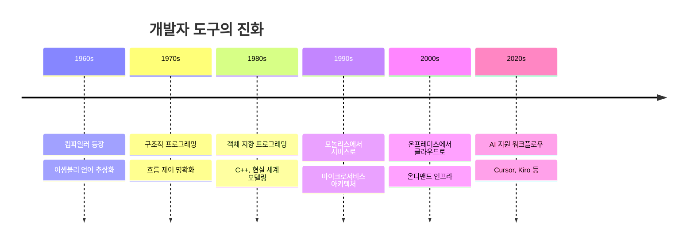

#### 주요 전환점

1. **프로그래밍 언어와 컴파일러 (1960년대)**
   - 어셈블리를 배움으로써 `loop`나 `if-else`가 기계 코드로 어떻게 변환되는지 이해
   - 컴파일러가 대부분의 개발자에게 필요한 최상위 추상화가 됨

2. **구조적/객체 지향 프로그래밍 (1970년대~)**
   - 비구조적 코드의 혼란에서 벗어남
   - 현실 세계 개념을 코딩으로 모델링

3. **모놀리스에서 서비스로 (1990년대 후반)**
   - 아마존이 모놀리스를 서비스 단위로 분리
   - 개발자들이 더 빠르게 움직이고, 다른 팀으로부터 독립적으로 작업

4. **온프레미스에서 클라우드로 (2000년대)**
   - 온디맨드 인프라로 하드웨어 대기 불필요
   - 자유로운 실험 환경 확보

5. **AI 기반 워크플로우 (현재)**
   - VI → Visual Studio → VS Code → Cursor, Kiro
   - AI 지원 워크플로우로 생산성 극적 향상
   - **단, 작업은 도구가 아닌 개발자 본인의 것**

---

## 2. 르네상스 개발자(Renaissance Developer) 프레임워크

### 현재 시대: 다중 황금기의 교차점

Jeff Bezos가 언급한 것처럼, 현재는 우주 여행, 인공 지능, 로봇 공학 등 여러 황금기가 동시에 모이는 **진앙지(epicenter)**이다. 한 분야의 발전이 다른 분야의 발전을 가속화하며, 이는 역사적으로 **르네상스(Renaissance)** 시대와 유사하다.

### 르네상스 시대의 특징

- **재탄생(Rebirth)**: 암흑기 이후 호기심이 모든 것을 변화시킨 시기
- **주요 인물**: 메디치 가문(최초의 벤처 자본가), 갈릴레오, 코페르니쿠스, 페트라르카, 다빈치
- **도구의 발전**: 연필, 소실점, 현미경, 망원경, 인쇄기

### 르네상스 개발자의 5가지 자질

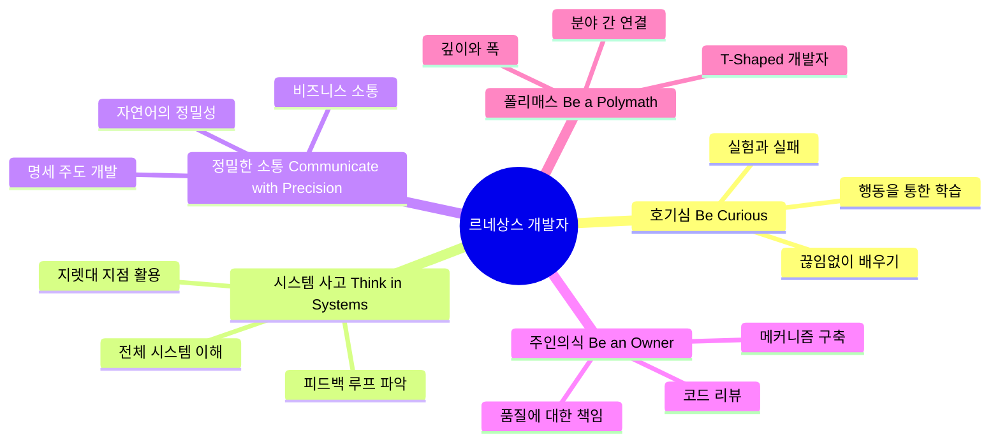

---

## 3. 첫 번째 자질: 호기심을 가져라 (Be Curious)

### 핵심 원칙

> "우리는 우리가 아는 것이 아니라, 배우고자 하는 것이다" - Rita Mae Brown

### 실험과 실패를 통한 학습

> **"학습은 문서가 아니라 실패를 통해 일어난다"**
>
> 최적의 성장은 호기심이 도전과 만나는 지점에서 발생한다.

- 새로운 발명을 위해서는 **실험**이 필요
- 잘 실험하기 위해서는 **실패할 의지**가 있어야 함
- 레오나르도 다빈치가 날지 못한 비행기 모델을 만들었지만, 우리는 지금 비행하고 있음
- 문서를 읽는 것만으로는 한계가 있음 - **행동을 통한 학습(Learning by Doing)**이 핵심

#### 📌 Yerkes-Dodson 법칙

스트레스와 성능 사이에는 종 모양 곡선으로 나타나는 관계가 있다.

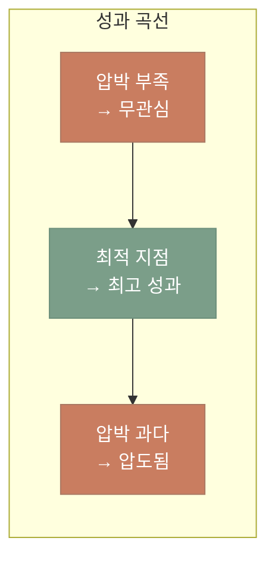

- **최적의 지점(sweet spot)**: 호기심이 도전과 만나는 상승 곡선 - 그때 뇌가 완전히 깨어 있고, 집중하며, 성장할 준비가 됨
- 이 지점에 도달하려면 스스로를 시험하는 위치에 두어야 함
- 편안하게 앉아 있어서는 안 됨

### 사회적 학습과 현장 경험

> **"커뮤니티 참여는 학습을 증폭시킨다 - 학습은 인지적인 동시에 사회적이다"**

- 학습은 **사회적(social)**: 서로 대화함으로써 진정으로 배움
- **'풀을 만져야 한다(touch the grass)'**: 평소 환경에서 벗어나 사용자 그룹, 컨퍼런스에 참석
- 날카로움을 유지하는 가장 좋은 방법: 무언가를 구축하는 다른 사람들 주변에 있는 것

---

## 4. 두 번째 자질: 시스템으로 생각하라 (Think in Systems)

### Donella Meadows의 시스템 정의

> "시스템이란 시간이 지남에 따라 고유한 행동 패턴을 생성하도록 상호 연결된 사물의 집합"
>
> **직역**: "여러 것들이 모여 있는데, 서로 연결되어 있어서, 계속해서 독특한 행동 방식을 만들어낸다"

### 옐로스톤 국립공원의 영양 단계 연쇄(Trophic Cascade)

#### 배경

1926년, 옐로스톤에서 **가축 보호를 위해 늑대를 박멸**했다. 이 단일 변경이 전체 생태계를 무너뜨렸고, 70년 후인 1995년에야 늑대를 다시 도입하여 생태계가 회복되었다.

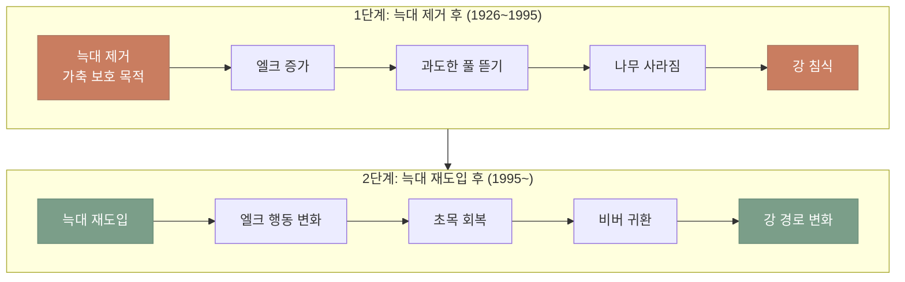

**핵심 교훈**: 구조가 변하면 행동이 변하고, 피드백이 변하면 결과가 변한다.

### 소프트웨어 시스템에서의 적용

| 변경 사항 | 시스템 영향 |
|----------|-----------|
| 재시도 정책 변경 | 로드에 영향 |
| 캐시 추가 | 트래픽 흐름 변화 |
| 팀 소유권 변경 | 제공 속도 변화 |

### 피드백 루프의 이해

시스템에서 결과가 다시 원인에 영향을 주는 순환 구조를 **피드백 루프**라고 한다. 크게 두 가지 유형이 있다.

#### 1. 강화 루프 (Reinforcing Loop)
**변화를 계속 증폭시키는 루프** - "눈덩이 효과"

**예시:**
- **은행 예금**: 이자 → 원금 증가 → 더 많은 이자 → 더 큰 원금 (복리)
- **소프트웨어**: 버그 → 급한 패치 → 코드 품질 저하 → 더 많은 버그
- **바이럴 마케팅**: 사용자 증가 → 더 많은 추천 → 더 많은 사용자

#### 2. 균형 루프 (Balancing Loop)
**시스템을 목표 상태로 되돌리는 루프** - "자동 조절"

**예시:**
- **에어컨**: 온도 상승 → 냉방 작동 → 온도 하강 → 냉방 정지
- **재고 관리**: 재고 감소 → 주문 증가 → 재고 보충 → 주문 감소
- **Auto Scaling**: 트래픽 증가 → 서버 추가 → 부하 감소 → 서버 유지

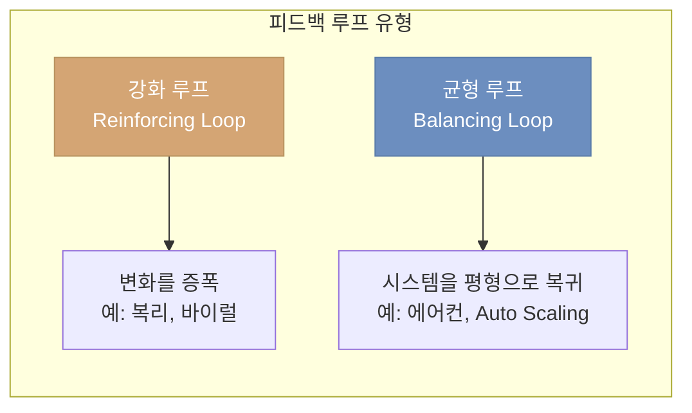

### 지렛대 지점(Leverage Point)

#### 개념: 작은 힘으로 큰 변화를 만드는 지점

물리학에서 **지렛대**는 작은 힘으로 무거운 물체를 들어올릴 수 있는 도구다. "받침점만 주면 지구도 들어올릴 수 있다" - 아르키메데스

시스템에서 **지렛대 지점**이란 **작은 변화가 시스템 전체에 큰 영향을 미치는 지점**을 말한다.

#### 예시

| 상황 | 일반적 접근 (큰 노력) | 지렛대 지점 (작은 변화, 큰 효과) |
|------|---------------------|----------------------------|
| **성능 문제** | 모든 코드 최적화 | 병목 지점 하나 해결 → 전체 성능 2배 |
| **옐로스톤** | 모든 동물 관리 | 늑대 하나 도입 → 생태계 전체 변화 |
| **아마존** | 고객 서비스 교육 강화 | 안돈 코드 버튼 → 시스템적 문제 해결 |
| **배포 시간** | 모든 팀 프로세스 개선 | CI/CD 자동화 → 전체 배포 시간 단축 |

#### 핵심 교훈

- 시스템의 모든 부분이 동일한 영향력을 갖는 것은 아님
- **어디를 건드리느냐**가 **얼마나 건드리느냐**보다 중요
- 르네상스 개발자는 탄력적인 시스템 구축을 위해 이러한 지렛대 지점을 찾는 더 큰 그림을 이해해야 함

---

## 5. 세 번째 자질: 정밀하게 소통하라 (Communicate with Precision)

### 소통 능력의 중요성

- 생각을 명확하게 표현하는 능력은 생각 자체만큼 중요
- 엔지니어와 기술 리더가 경력을 위해 할 수 있는 가장 중요한 일: **강력한 소통 기술 연습**

### 비즈니스와의 소통 도구: 티어링(Tiering)

#### 티어링이란?

시스템의 기능들을 **비즈니스 중요도**에 따라 **등급을 나누는 것**. 모든 기능에 같은 수준의 자원과 안정성을 투자하는 것은 비효율적이므로, 중요한 것부터 우선순위를 정한다.

**왜 필요한가?**
- 엔지니어는 "모든 게 중요하다"고 생각하기 쉬움
- 비즈니스는 "정말 돈이 되는 기능"과 "없어도 괜찮은 기능"을 구분해야 함
- 한정된 자원으로 최대 효과를 내려면 우선순위가 필요

**비유:**
```
병원 응급실의 트리아지(Triage)
- 빨강 (즉시): 생명 위협, 즉각 치료
- 노랑 (긴급): 중요하지만 조금 기다릴 수 있음
- 초록 (지연 가능): 안정적, 나중에 처리 가능
```

#### 아마존 홈페이지 티어링 사례

| 티어 | 구성 요소 | 가용성 예시 | 의미 |
|------|----------|-----------|------|
| **Tier 1** | 검색, 탐색, 장바구니, 결제, 리뷰 | 4-Nines (99.99%) | **절대 죽으면 안 됨** - 이게 없으면 돈을 못 벌음 |
| **Tier 2** | 개인화, 추천 | 3-Nines (99.9%) | **중요하지만** - 없어도 일단 쇼핑은 가능 |
| **Tier 3** | 있으면 좋은 부분 | 2-Nines 또는 수동 장애 조치 | **부가 기능** - 잠깐 안 되도 괜찮음 |

**효과:**
- 비즈니스 담당자와 "무엇이 진짜 중요한가"를 명확히 소통
- 예산, 인력, 모니터링을 Tier 1에 집중
- 장애 시 복구 우선순위가 명확함

### AI 시대의 새로운 소통 과제

#### 자연어의 모호성 문제

> **"Let's eat, Grandma"** vs **"Let's eat Grandma"**
>
> - **쉼표 있음**: "할머니, 밥 먹자" (할머니에게 말을 거는 것)
> - **쉼표 없음**: "할머니를 먹자" (할머니가 음식이 되는 것!)
>
> 쉼표 하나가 생명을 구할 수 있다. 인간 언어는 본질적으로 모호하다.

> **"원하는 것을 명확하게 설명할 수 없다면, AI는 그저 추측할 뿐이다."**
> — Werner Vogels

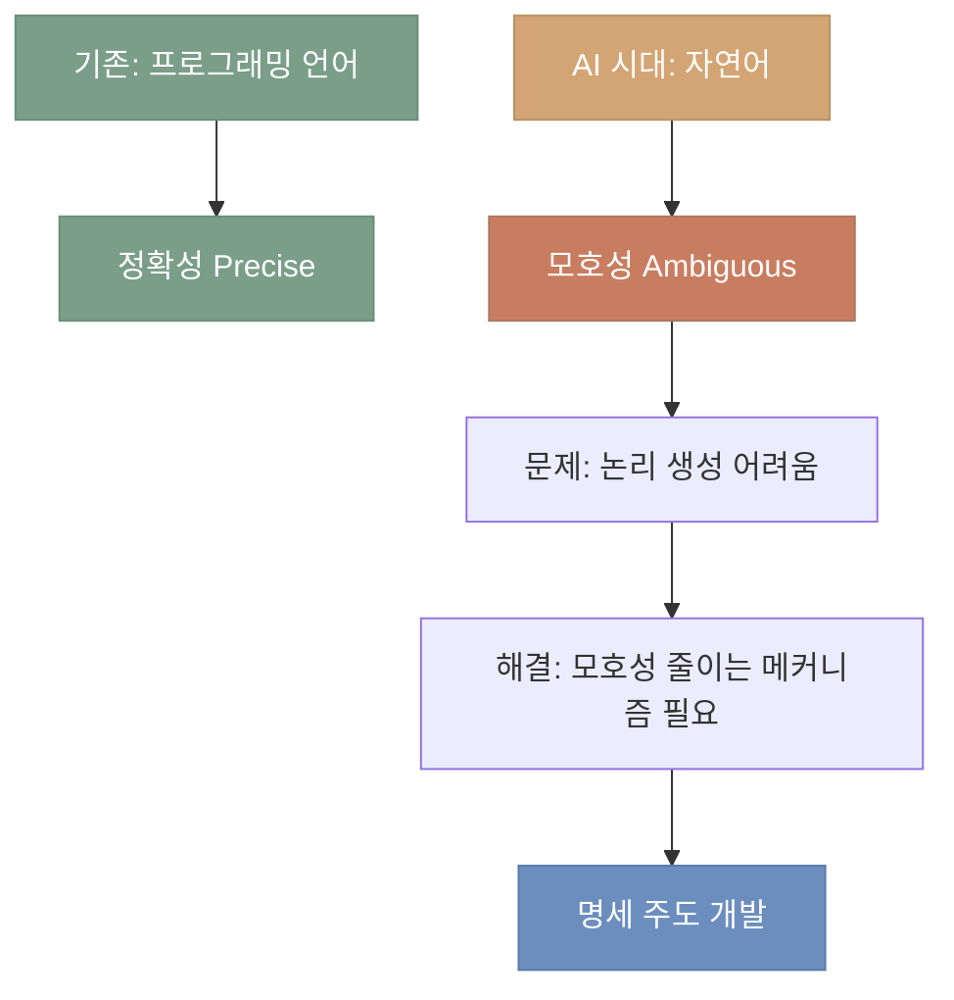

---

## 5.1. Spec-Driven Development (명세 주도 개발)

### 명세의 역사적 중요성

| 사례 | 설명 |
|------|------|
| **Dijkstra의 구조적 프로그래밍** | 구현 전 프로그램 정확성을 입증하는 공식 명세 기반 |
| **아폴로 유도 시스템** | 145,000줄 코드를 안내하는 세심한 명세, 달 착륙 청사진 |

### Kiro IDE의 Spec-Driven Development 진화

#### Clare Liguori의 경험 (AWS Senior Principal Software Engineer)

- AI가 생성한 코드는 좋았지만, 최종 소프트웨어는 원하는 대로 작동하지 않음
- 점점 더 상세한 프롬프트 → 본질적으로 **명세(specification)** 작성
- 이 아이디어가 **Kiro IDE** 개발의 계기

#### 신속한 프로토타이핑의 힘: Doug Engelbart의 마우스 (1964)

아이디어를 전달하는 가장 좋은 방법 중 하나는 프로토타입을 빠르게 구축하는 것이다.

1964년 SRI의 Doug Engelbart는 컴퓨터 화면을 가리키기 위해 바닥에 바퀴가 있는 장치에 대한 아이디어를 가지고 있었다. 그의 팀은 **나무 블록**으로 프로토타입을 빠르게 만들었고, 이 거친 프로토타입은 어떤 그림이나 설명보다 마우스가 무엇인지 더 잘 전달했다.

**Kiro도 같은 방식**: 첫 번째 프로토타입부터 Kiro IDE를 사용하여 Kiro IDE용 코드를 생성하며, 사양 기반 개발이 어떻게 작동할 수 있는지에 대한 많은 아이디어를 빠르게 반복했다.

#### 워크플로우 진화 과정

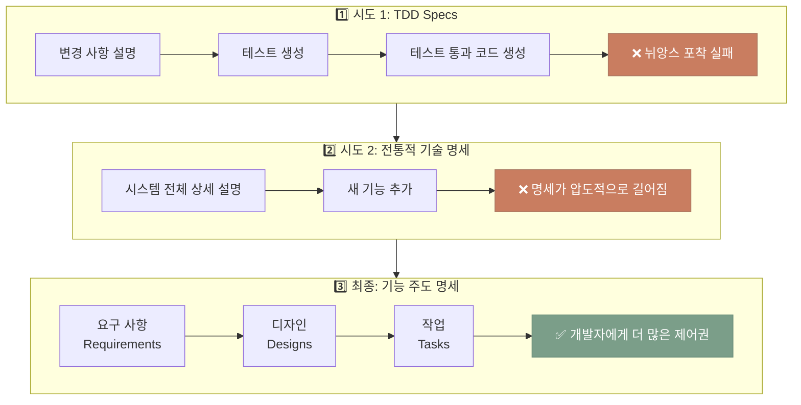

### Kiro IDE의 명세 주도 개발 워크플로우

#### 📌 Vibe Coding이란?

> **Vibe Coding**: "백만 가지 가능한 결과 중 하나가 의도와 일치하기를 바라는" 코딩 방식
>
> AI에게 모호한 프롬프트를 주고 결과를 기대하는 방식으로, 재현 가능성과 의도 일치성이 낮다.

#### 일반적인 AI 코딩 vs 명세 주도 개발

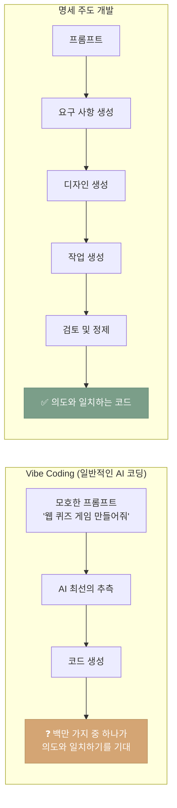

#### 실제 사례: 시스템 알림 기능 구축

1. **요구 사항 단계**: 어떤 에이전트 행동이 알림을 트리거해야 하는지 세부 사항 고려
2. **디자인 단계**: Kiro가 에이전트 코드 내 새 알림 시스템 구축 제안
3. **교훈**: 일반 AI 코딩이었다면 원치 않는 많은 코드 생성
4. **결과**: 명세를 반복하여 Electron의 네이티브 알림 API 기반으로 구축
5. **효과**: 일반 AI 코딩보다 **거의 절반의 시간**에 기능 출시

### 고객과의 소통: 문제 이해

- 고객이 "Gen AI로 무엇을 해야 하나요?"라고 기술 솔루션을 가지고 올 때
- 엔지니어는 깊이 파고들어 고객이 해결하려는 **문제**나 **기회**가 무엇인지 이해해야 함

---

## 6. 네 번째 자질: 주인이 되어라 (Be an Owner)

### 핵심 원칙

> "당신이 만들면, 당신이 소유한다 (You build it, you own it)"

AI는 더 큰 시스템을 구축하고, 더 많은 아이디어를 탐색하고, 그 어느 때보다 빠르게 움직일 수 있게 해줄 것이다. Daft Punk이 말했듯이, 이러한 도구는 **"harder, better, faster, stronger"**를 구축하는 데 도움이 된다.

### AI 코딩의 위험과 책임

| 구분 | 설명 |
|------|------|
| **일반적 AI 코딩** | 괜찮지만, 무엇이 구축되고 있는지 면밀히 주의 필요 |
| **도박 vs 엔지니어링** | IDE 레버를 당기고 좋은 결과를 바라는 것은 도박 |
| **책임 소재** | 규제 위반 코드를 AI가 생성해도 **책임은 개발자 본인** |

### 변화하는 세계: 작성 vs 검토

AI 시대에 개발자의 역할이 **"직접 코드 작성"**에서 **"AI가 작성한 코드 검토"**로 이동하고 있다.

#### 과거 vs 현재

| 구분 | 과거 (전통적 개발) | 현재 (AI 시대) |
|------|------------------|--------------|
| **코드 작성** | 개발자가 직접 한 줄씩 작성 | AI가 수십~수백 줄 자동 생성 |
| **시간 소요** | 작성에 많은 시간 | 작성은 순식간 |
| **이해 시점** | 작성하면서 자연스럽게 이해 | 생성 후 검토하면서 이해해야 함 |
| **주요 작업** | ⌨️ 코딩 (Writing) | 👀 코드 리뷰 (Reviewing) |

#### 핵심 문제

```
AI 생성 속도 >>> 인간 이해 속도
```

- **AI**: 1초에 100줄 생성 가능
- **개발자**: 100줄을 이해하고 검증하는 데 훨씬 오래 걸림
- **결과**: "작성" 시간은 줄지만, "검토" 시간은 증가
- **위험**: 제대로 이해하지 못한 채 코드가 프로덕션에 배포될 수 있음

**따라서 개발자는 이제 "빠른 타이핑 능력"보다 "코드를 정확히 읽고 검증하는 능력"이 더 중요해졌다.**

### AI 시대의 두 가지 주요 과제

#### 1. 검증 부채 (Verification Debt)

> AI는 개발자가 이해할 수 있는 것보다 빠르게 코드를 작성한다. 이것이 **생성과 이해 사이의 위험한 격차**를 만든다.

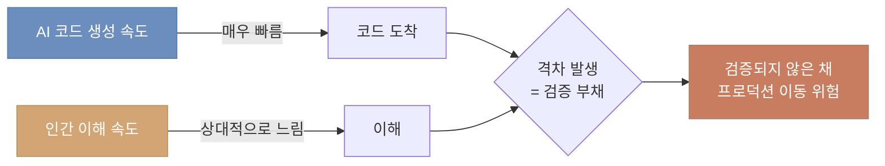

#### 2. 환각 (Hallucination)

- AI 모델이 자신감 있어 보이지만 완전히 틀린 디자인 생성 가능
- **존재하지 않는 API를 만들어냄**: LLM이 실제로 없는 메서드나 라이브러리를 제안
- 과도하게 설계된 솔루션이나 부적절한 아키텍처 제안
- 그럴듯해 보이지만 현실에 근거하지 않음

**해결 방안**:

#### 1. 자동 추론 (Automated Reasoning)

**수학적/논리적 방법으로 코드가 올바른지 증명하는 기술**

**일반 테스트 vs 자동 추론:**

| 구분 | 일반 테스트 | 자동 추론 |
|------|-----------|----------|
| 방식 | 샘플 입력으로 실행해서 확인 | 수학적으로 모든 경우 증명 |
| 범위 | 테스트한 케이스만 검증 | **모든 가능한 입력** 검증 |
| 예시 | "1, 2, 3 넣어봤더니 작동함" | "모든 정수에서 작동함을 증명" |

**AWS 실제 사용 예시:**
- **S3**: 데이터 손실이 절대 발생하지 않음을 수학적으로 증명
- **DynamoDB**: 분산 잠금 알고리즘의 정확성 증명
- AI가 생성한 코드가 보안 취약점이 없음을 자동으로 검증

**쉬운 비유:**
```
일반 테스트 = 다리에 트럭 몇 대 올려보고 "괜찮네!"
자동 추론 = 공학적 계산으로 "최대 하중 50톤까지 안전함" 증명
```

#### 2. CI/CD 파이프라인 자동화 테스트
- CI/CD 파이프라인에 강력한 자동화 테스트 구축
- 코드가 배포되기 전 자동으로 검증

### 메커니즘(Mechanism)을 통한 품질 관리

**문제 상황:**
- AI가 빠르게 코드를 생성 → 검증 부채, 환각 문제 발생
- 개발자가 "열심히 검토하겠다"는 **선의**만으로는 부족
- 바쁠 때, 피곤할 때, 급할 때 → 실수 발생

**핵심 질문:**
> "개발자의 의지와 노력에만 의존할 것인가? 아니면 자동으로 작동하는 시스템을 만들 것인가?"

이것이 **메커니즘 vs 선의** 논쟁이다.

#### 📌 메커니즘 vs 선의

**용어 정의:**
- **선의 (Good Intentions)**: "잘하고 싶다"는 마음가짐, 개인의 의지와 노력
- **메커니즘 (Mechanism)**: 체계화된 시스템, 자동으로 작동하는 프로세스

**왜 구분하는가?**

| 선의만 있을 때 | 메커니즘이 있을 때 |
|-------------|-----------------|
| 😊 "이번엔 꼭 잘할게요!" | ⚙️ 시스템이 자동으로 강제 |
| 사람에 따라 결과가 달라짐 | 누가 해도 일관된 결과 |
| 피곤하면 실수 가능 | 피곤해도 시스템이 막아줌 |
| "깜빡했어요" 가능 | 깜빡이면 알람이 울림 |

**일상 예시:**
```
선의: "다이어트 할 거야! 매일 운동할 거야!"
     → 3일 후 포기

메커니즘: "헬스장 3개월 결제 + 친구와 매일 아침 8시 약속"
          → 안 가면 돈 날리고 친구가 연락 옴
          → 강제로라도 하게 됨
```

> **메커니즘**과 **선의(good intentions)**는 같지 않다

#### Jeff Bezos의 아마존 고객 서비스 사례

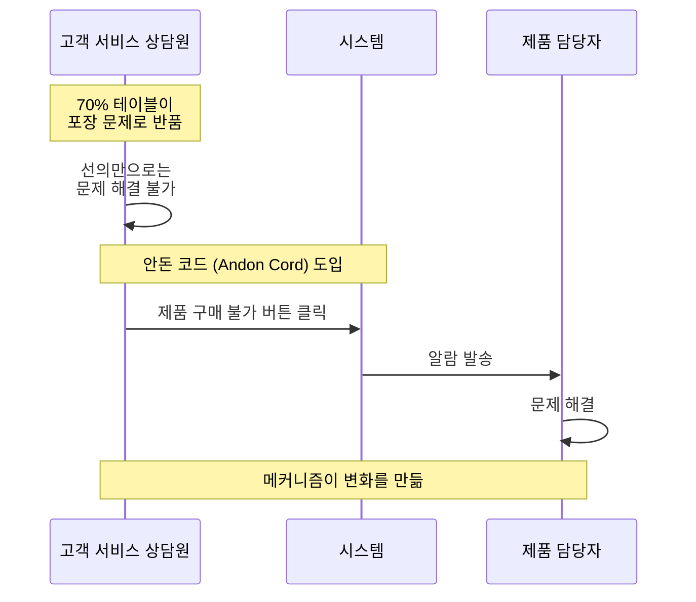

#### 기술 세계의 메커니즘 예시

| 메커니즘 | 팀 | 효과 |
|---------|-----|------|
| **COE (Correction of Error)** | Amazon 전체 | 장애 발생 시 근본 원인 분석 및 재발 방지 프로세스 |
| **내구성 검토 (Durability Reviews)** | S3 | 데이터 지속성에 영향을 주는 모든 변경에 대해 위험 모델링 |
| **코드 리뷰** | 전체 | 의도와 구현이 만나는 지점, 가정 질문, 놓친 부분 포착 |

> **"선의만으로는 불충분하다. 체계적인 메커니즘이 일관된 결과를 보장한다."**

### 코드 리뷰의 중요성 증대

코드 리뷰는 우리 모두 싫어한다. 하지만 중요하다.

- 의도와 구현이 만나는 순간을 만듦
- 다른 엔지니어가 가정에 의문을 제기하고 작성자가 더 이상 보지 못하는 것을 잡을 수 있음
- AI 주도 세계에서 **코드 리뷰가 균형을 회복하는 통제 지점**
- 인간의 판단을 루프에 다시 가져와 소프트웨어가 예상대로 작동하는지 확인
- **인간 대 인간 코드 리뷰(human-to-human code reviews)** 필수

#### 시니어-주니어 코드 리뷰의 가치

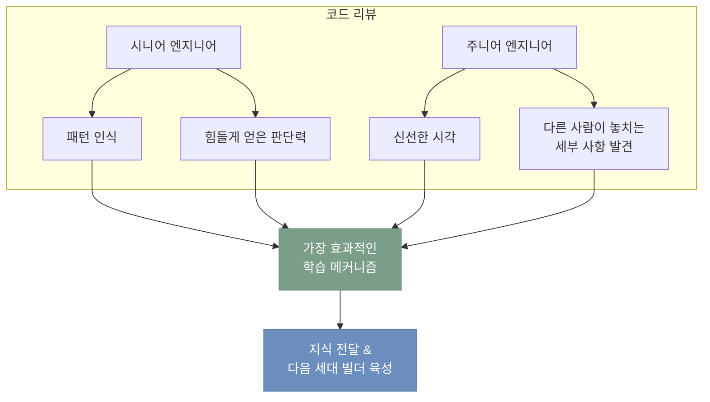

이것이 우리가 **지식을 전달**하고 **다음 세대의 빌더를 키우는** 방법이다.

> AI가 많은 것을 바꾸겠지만, **기술(craft)은 여전히 사람 대 사람으로 배운다**

---

## 7. 다섯 번째 자질: 폴리매스가 되어라 (Be a Polymath)

### 폴리매스(Polymath)의 정의

- 그리스어 `poly`(많은) + `matanian`(배우다) = **'많은 것을 배우는 사람'**
- 깊은 도메인 경험 + 여러 주제에 걸친 지식
- **레오나르도 다빈치**: 화가, 엔지니어, 해부학자, 발명가 - 완벽한 폴리매스 예시

### I-Shaped에서 T-Shaped 개발자로

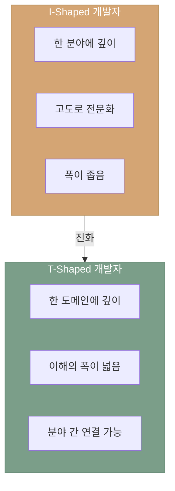

### Jim Gray 사례: T-Shaped 개발자의 전형

Werner Vogels의 멘토이자 **튜링상 수상자**, **데이터베이스 트랜잭션의 개척자**인 Jim Gray는 폴리매스의 완벽한 예시다.

#### 깊이: 데이터베이스 전문가

- 데이터베이스 트랜잭션 이론을 만든 세계적 권위자
- SQL 최적화, 디스크 I/O 패턴까지 깊은 이해

**유명한 일화:**
```
서버실에 들어가서 30초 동안 디스크 소리만 듣고:
"데이터베이스 레이아웃이 잘못되었고, 너무 많은 무작위 접근이 발생하고 있다"

→ 디스크 소리만으로 성능 문제의 원인을 진단
→ 아키텍처 재설계 조언 → 성능 극적 향상
```

이것이 **깊이(Depth)** - 한 분야를 완전히 마스터함.

#### 폭: 비즈니스 문제 이해

Jim Gray의 시스템 설계 철학:

> **"데이터에 대해 묻고 싶은 20가지 중요한 질문을 달라, 그러면 시스템을 설계해 주겠다"**

**의미:**
- 기술 먼저가 아니라 **비즈니스 요구사항 먼저** 이해
- "어떤 질문에 답하고 싶은가?"를 파악한 후 시스템 설계
- 단순히 데이터베이스 전문가가 아니라 **문제 해결자**

**실제 사례: 슬론 디지털 스카이 서베이 (Sloan Digital Sky Survey)**

1. **문제**: 천문학자들이 우주 데이터를 효율적으로 검색하고 싶음
2. **Jim Gray의 접근**:
   - 천문학자들이 묻고 싶은 질문들을 먼저 이해 (예: "특정 별의 이동 경로는?", "은하의 분포는?")
   - 그 질문들에 최적화된 데이터베이스 설계
3. **결과**: 천문학 연구를 혁신적으로 가속화

이것이 **폭(Breadth)** - 다른 도메인(천문학)을 이해하고 자신의 전문성(DB)과 연결.

#### T-Shaped의 힘

```
     폭: 천문학, 비즈니스 이해
     ㅡㅡㅡㅡㅡㅡㅡㅡㅡㅡㅡㅡㅡ
          |
          | 깊이: 데이터베이스
          | 트랜잭션, I/O 최적화
          |
```

Jim Gray는 데이터베이스에 깊은 지식을 가졌지만, 동시에 사용자(천문학자)의 문제를 이해하는 폭을 가져서 **진짜 가치 있는 솔루션**을 만들 수 있었다.

### T-Shaped 개발자의 장점

| 예시 | 효과 |
|------|------|
| 프론트엔드 성능 이해하는 데이터베이스 개발자 | 자신의 작업이 전체 시스템을 어떻게 형성하는지 인식 |
| 비용 인식 아키텍처 이해하는 개발자 | 더 나은 아키텍처 선택 가능 |
| 지식의 폭 | 트레이드오프 이해, 구축하는 것을 개선하는 관점 제공 |

---

## 8. 르네상스 개발자 프레임워크 요약

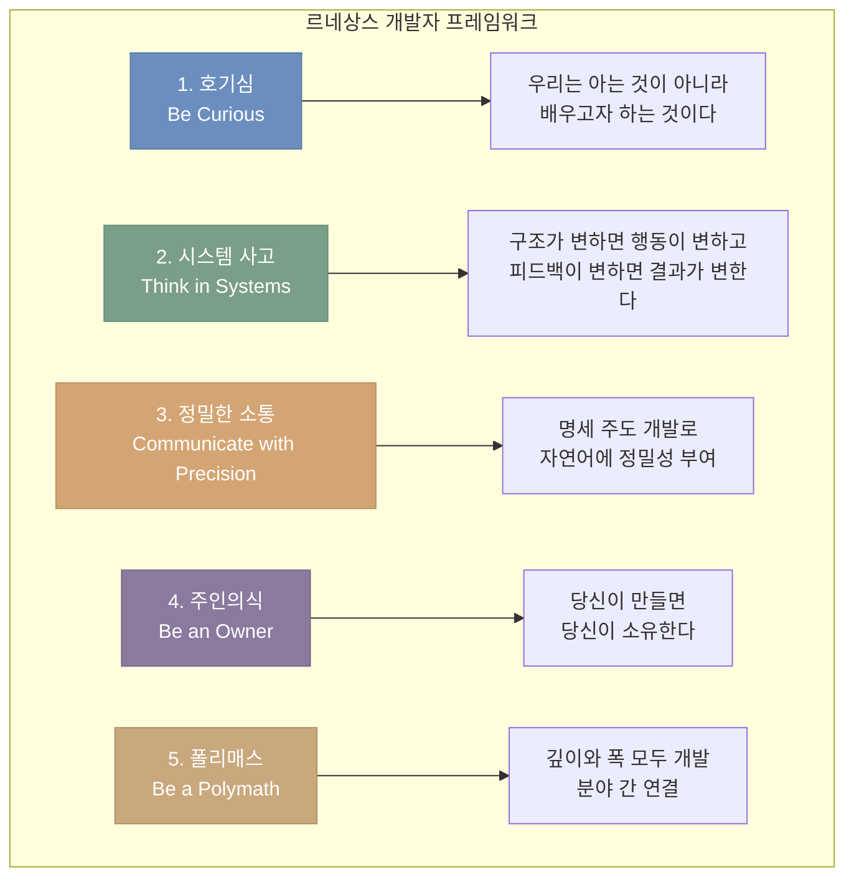

---

## 9. 마무리: 보이지 않는 작업에 대한 자부심

### 개발자의 보이지 않는 가치

- 고객이 앱을 클릭하거나 패키지를 받을 때, 밑에서 진행되는 모든 작업에 대해 생각하지 않음
- 데이터베이스 엔지니어의 놀라운 작업을 칭찬하지 않음
- **우리만이 그 작업의 가치를 이해함**

### 보이지 않는 시스템들

| 항목 | 설명 |
|------|------|
| 밤새도록 유지되는 시스템 | 아무도 눈치채지 못함 |
| 깔끔한 배포 | 아무도 보지 못함 |
| 아무도 눈치채지 못하는 롤백 | 성공의 증거 |

### 최고의 빌더를 정의하는 것

> **아무도 보지 않을 때에도 일을 제대로 하는 것**
>
> 우리가 이 일을 잘하는 유일한 이유는 **운영 우수성(operational excellence)에 대한 우리 자신의 직업적 자부심**이다.

Vogels가 개발자들이 매일 제공하는 작업을 볼 때, 그는 그 헌신을 어디에서나 본다.

> "그것에 대해 저는 여러분을 매우 자랑스럽게 생각합니다. 여러분이 하는 모든 일에 감사드립니다."

---

## 결론

Werner Vogels는 14년간의 re:Invent 키노트를 마무리하며, AI 시대에도 개발자가 여전히 필수적인 역할을 할 것임을 강조했다. 르네상스 개발자 프레임워크는 개발자들이 새로운 기술 변화에 적응하면서도 핵심 가치를 유지할 수 있는 길을 제시한다.

**호기심, 시스템 사고, 정밀한 소통, 주인의식, 폴리매스** - 이 다섯 가지 자질을 갖춘 개발자는 AI 도구의 발전과 함께 더욱 강력해질 것이다.