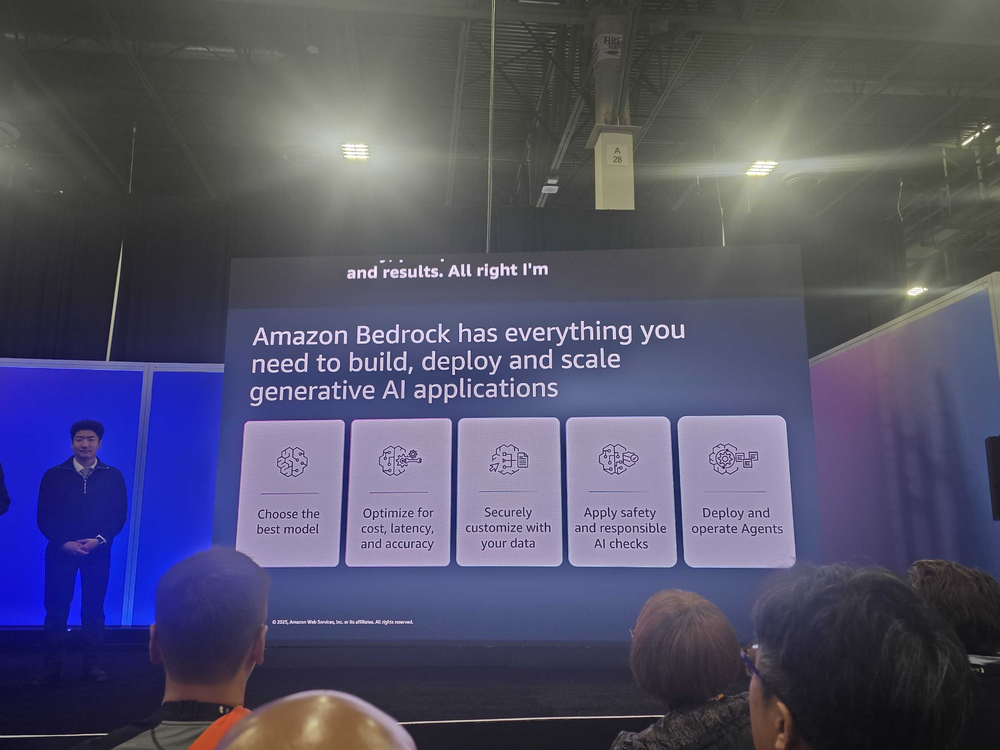
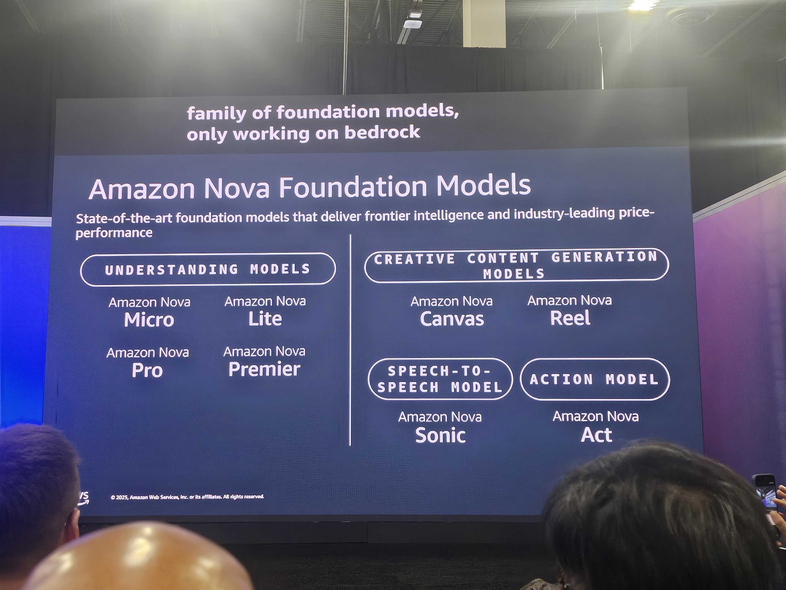
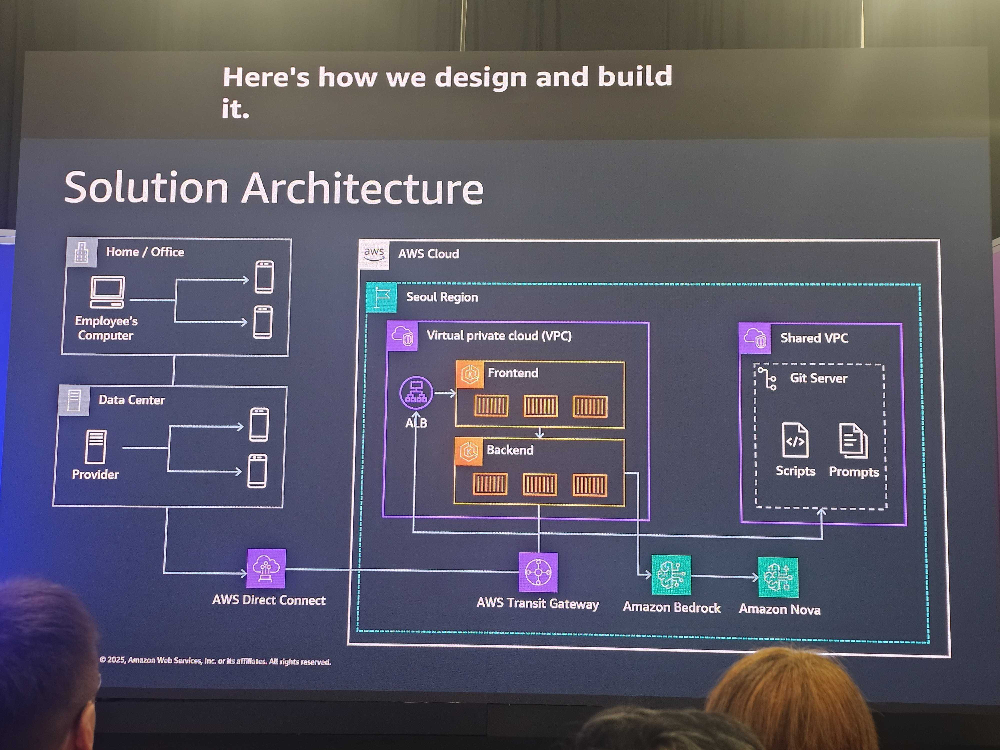

# AWS re:Invent 2025 - Toss Securities의 AI 기반 슈퍼앱 운영 자동화 (GBL301)

## 세션 개요

**발표자**
- Chong Mimmoon (AWS Senior Manager)
- Nam Cho (Toss Securities)

**주제**: 토스증권이 AI 기술과 AWS 서비스를 활용하여 슈퍼앱 운영을 어떻게 혁신했는지 소개

---

## Part 1: Amazon Bedrock & Nova 소개 (AWS)

### Amazon Bedrock
생성형 AI 애플리케이션 구축을 위한 완전관리형 플랫폼으로 5가지 핵심 기능 제공:



| 기능 | 설명 |
|------|------|
| **모델 선택** | 다양한 업계 선도 파운데이션 모델 중 최적 모델 선택, 코드 변경 없이 모델 교체 가능 |
| **비용 및 성능 최적화** | 지능형 프롬프트 라우팅, 프롬프트 캐싱, 유연한 추론 옵션 등 |
| **쉬운 커스터마이징** | 자체 데이터로 모델 미세 조정, 복잡성 없이 RAG 설정 가능 |
| **보안** | AWS 내에서 데이터 비공개 유지, 엔터프라이즈급 보안, 유해 콘텐츠 필터링 |
| **에이전트** | 단순 챗봇을 넘어 복잡한 작업을 수행하는 에이전트 구축 및 배포 |

### Amazon Nova 모델 제품군


Bedrock에서만 작동하는 AWS 자체 파운데이션 모델 제품군 (업계 최고의 가격 대비 성능)

#### 이해(Understanding) 모델
| 모델 | 입력 | 출력 |
|------|------|------|
| **Nova Micro** | 텍스트 | 텍스트 |
| **Nova Lite** | 텍스트, 이미지, 비디오 | 텍스트 |
| **Nova Pro** | 텍스트, 이미지, 비디오 | 텍스트 |
| **Nova Premier** | 텍스트, 이미지, 비디오 | 텍스트 |

#### 생성(Creative) 모델
| 모델 | 기능 |
|------|------|
| **Nova Canvas** | 이미지 생성 |
| **Nova Reel** | 비디오 생성 |
| **Nova Sonic** | 음성 입력 → 음성 출력 (Speech-to-Speech) |
| **Nova Act** | 웹 브라우저에서 사용자 대신 자동으로 작업 수행 |

**토스증권 활용 모델**: Nova Micro, Nova Lite (테스트 자동화용)

---

## Part 2: 토스증권의 도전과 해결 (Toss Securities)

### 토스(Toss) 소개

한국의 슈퍼앱으로 일상의 거의 모든 영역을 지원:
- 뱅킹, 투자, 쇼핑, 게임, 라이드 헤일링 등

**토스증권 성과**: 출시 3년 만에 한국 해외주식 거래 플랫폼 1위 달성

---

### 직면한 문제점

> "빠른 성장은 더 빠른 문제를 만들었다"

#### 1. 테스트 속도 문제
- 매일 수십 개의 새 버전 배포 (뱅킹, 결제, 증권, 커머스, 게임 동시 진행)
- 단위 테스트도 힘들고, 통합 테스트는 모든 것을 더 느리게 만듦
- **결과**: 너무 많은 릴리스, 너무 적은 시간

#### 2. 디바이스 파편화
- 국가, 디바이스, OS 버전별 테스트가 일상적인 고통
- 원격 근무 환경에서 동일한 디바이스 접근 어려움
- 이슈 재현을 위해 특정 모델을 가진 사람을 찾아다녀야 함
- 예: "iPhone 17 Pro Max 가진 사람 누구 있어요?"

#### 3. 시간대 문제 (서머타임)
- 서머타임 시작 시 글로벌 시장 시간이 예상치 못하게 변경
- 트레이딩 시스템은 시장 개장 시간에 정확히 테스트 필요
- QA 엔지니어들이 새벽까지 수동으로 거래 확인
- 피로하고, 오류 발생 가능성 높고, 지속 불가능

### 문제 요약

| 카테고리 | 설명 |
|----------|------|
| 품질 유지 | 배포 속도에 맞춰 품질 유지 어려움 |
| 환경 복잡성 | 다양한 모델과 제한된 환경에서의 테스트 극도로 복잡 |
| 가시성 부족 | 모니터링, 스케줄링, 로그 검증에 대한 실시간 가시성 부재 |

---

### 해결책: 자동화 플랫폼 구축

#### 핵심 기능

**1. 원격 디바이스 제어**
- 웹 인터페이스로 어떤 디바이스든 즉시 제어
- 지연 없음 (YouTube 비디오도 끊김 없이 재생)

**2. 네트워크 패킷 검사**
- 테스트 중 생성되는 모든 네트워크 패킷 자유롭게 검사
- 예상 로그 생성 여부 즉시 검증 가능

**3. 자동화 워크플로우**
- 반복적으로 실행되는 테스트 워크플로우 생성
- 각 단계를 시각적으로 검토 및 수정
- 필요한 시간에 정확히 실행되도록 스케줄링

**4. AI 기반 대화형 테스트**
- 자연어로 테스트 생성 가능
- 예: "네이버 열어줘", "5초마다 hello world DM 보내줘"
- 채팅으로 생성된 테스트는 워크플로우로 저장되어 재사용 가능
- 실시간으로 대화를 통해 워크플로우 수정 가능

---

### 시스템 아키텍처


#### 인프라 구성
```
┌─────────────────────────────────────────────────────────┐
│                    AWS 격리 환경                          │
│  ┌─────────────┐  ┌─────────────┐  ┌─────────────┐      │
│  │   EC2       │  │  Git Server │  │  Bedrock    │      │
│  │  (서비스)     │  │ (코드/스크립트)│  │ (격리 모델)   │      │
│  └─────────────┘  └─────────────┘  └─────────────┘      │
└─────────────────────────────────────────────────────────┘
          ↑ Direct Connect (보안 접속)
┌─────────────────────────────────────────────────────────┐
│              사무실 / 재택 근무 환경                         │
└─────────────────────────────────────────────────────────┘
```

#### 디바이스 제어 구조
```
Provider (직원 PC 또는 데이터센터 서버)
    ↓ USB 연결
모바일 디바이스 (Mobile Controller 자동 설치)
    ↓ gRPC 통신
Provider ←→ HTTP/WebSocket ←→ 자동화 플랫폼 서버
```

**특징**:
- 다중 디바이스 제어 가능
- 자신의 디바이스 연결 가능
- 추가 설정 없이 기존 테스트 스크립트 실행

#### 한국 금융 규정 준수
- AWS에서 격리된 모델 인스턴스 활용 (Amazon Bedrock)
- 안전한 AI 구축

---

### 워크플로우 시스템 설계 철학

> "Simple is Best" - 토스의 개발 문화

#### 기존 솔루션의 문제
- 지나치게 복잡함
- 한국 금융 규정에 맞게 현지화 어려움
- 필요한 성능 제공 불가

#### 설계 원칙

| 원칙 | 구현 방식 |
|------|----------|
| **단순성** | 토폴로지 정렬 같은 복잡한 알고리즘 대신, 연결된 노드 정보(이전/다음)와 트리거 ID만 사용 |
| **유연성** | 런타임에 새 노드 추가 가능, 즉시 모든 워크플로우에서 사용 가능 |
| **타입 안정성** | TypeScript 사용 - 타입 시스템으로 각 노드의 입력 파라미터 정의 및 검증 용이 |

---

### AI 에이전트 동작 방식

#### 테스트 실행 흐름

```
사용자 입력: "아마존 주가 알려줘"
        ↓
1. RAG 검색: 유사한 테스트 케이스 검색
   - 유사 예제 있음 → 참조하여 실행
   - 없음 → 직접 추론으로 폴백
        ↓
2. 화면 요소 분석 (Nova Lite 멀티모달)
   - 먼저: 디바이스의 덤프 텍스트/구조화 데이터 분석
   - 폴백: 이미지 이해를 통해 요소 직접 식별
        ↓
3. 액션 실행
```

#### 에이전트의 4단계 프로세스

```
Plan (계획) → Analyze (분석) → Action (실행) → Review (검토)
```

**워크플로우 에이전트도 동일한 원칙 적용**:
1. 기존 워크플로우 분석
2. 누락된 컴포넌트 또는 필요한 변경 식별
3. 직접 적용

#### 에이전트 구축 비유

> "에이전트를 구축하는 것은 휴머노이드 로봇을 만드는 것과 같다"

- **눈 (Eyes)**: 컨텍스트를 이해하는 능력
- **팔 (Arms)**: 필요한 액션을 수행하는 능력 (MCP를 통해 효과적으로 구현)

결국, 이미 존재하는 것을 조합하고 재발명하는 것이 핵심

---

### 플랫폼의 성과

| 성과 | 설명 |
|------|------|
| **위치 독립성** | 물리적 위치에 구애받지 않고 언제든 원격으로 디바이스 접근 (디지털 노마드처럼) |
| **자동화된 테스트** | 필요할 때 언제 어디서나 자동으로 테스트 실행 및 검증, 일관된 품질 보장 |
| **의미 있는 업무 집중** | 반복적인 테스트 대신 의미 있는 작업에 집중 가능 |

---

### 향후 계획

#### 1. 디자인 시스템 통합 (Figma)
- 에이전트에게 제품에 대한 훨씬 풍부한 컨텍스트 제공

#### 2. Atlas Map 프로젝트
- 앱에서 감지되는 모든 새 화면과 전환을 자동으로 캡처 및 분석
- 앱의 "신경 지도" 역할
- 모든 전환을 연결하여 에이전트를 훨씬 더 스마트하게 만듦

#### 3. 궁극적 목표
- 자연어 테스트 시나리오를 이해하고
- 가능한 모든 상호작용을 자율적으로 테스트하는 에이전트 구축

---

## 핵심 시사점

1. **빠른 성장에는 자동화가 필수**: 수동 테스트로는 빠른 배포 속도를 따라갈 수 없음

2. **AI + 멀티모달의 힘**: Nova Lite의 멀티모달 기능으로 텍스트와 이미지 모두 이해하여 화면 요소 식별

3. **단순함이 최고**: 복잡한 알고리즘 대신 단순한 설계로 유연성과 확장성 확보

4. **MCP를 통한 에이전트 구축**: 에이전트의 "팔"을 MCP로 효과적으로 구현

5. **금융 규정 준수**: AWS의 격리된 환경을 활용하여 한국 금융 규정 준수

6. **개발자 경험 향상**: 코딩 에이전트 덕분에 팀과 만나고, 풀스택 프로젝트를 즐겁게 구축할 시간 확보

---

## 사용된 AWS 서비스

- **Amazon Bedrock**: AI 에이전트 및 추론
- **Amazon Nova Micro/Lite**: 테스트 자동화용 모델
- **Amazon EC2**: 서비스 배포
- **AWS Direct Connect**: 보안 네트워크 연결
